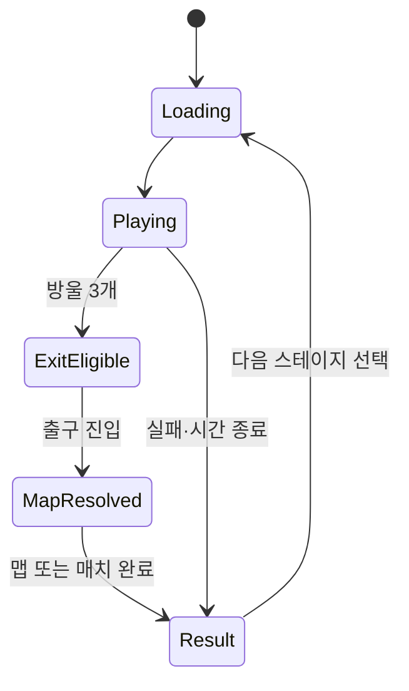

# ANIMOL · Unity CLI용 전체 UI 및 코어 로직 구현 명령

**문서 성격:** 이 파일을 Unity 프로젝트 루트에서 작업하는 Unity CLI/MCP 에이전트에게 그대로 전달하는 실행 명령. 단순 기획 요약이나 화면 목업 요청이 아니다.  
**작성일:** 2026-09-28  
**우선순위:** 이 문서의 최신 사용자 결정 > 기존 `ANIMOL_스크립트_책임_및_서버_아키텍처_v1.0.md` > 이전 종합 기획안 v0.2.  
**실행 대상:** ANIMOL Unity 2D 신규 프로젝트. 실제 저장소·Unity Editor 경로는 이 문서에 주어지지 않았으므로 작업 시작 시 확인한다.

> **즉시 실행 지시:** 현재 Unity 프로젝트를 조사하고 기존 코드/씬을 최대한 재사용한 뒤, 아래 M0~M5를 순서대로 **실제 코드·씬·프리팹·에셋·검증 결과**로 구현하라. 화면 배치만 제시하거나 구현 계획만 보고하고 멈추지 말라. 각 마일스톤 뒤 컴파일/핵심 동작을 확인하고 상태 문서를 갱신한 다음, 가능한 범위의 다음 마일스톤으로 계속 진행하라. Unity 프로젝트가 전혀 없거나 Unity Editor가 실행되지 않는다면 구현했다고 주장하지 말고 정확한 차단 사유와 준비한 파일을 보고하라.

## 0. 이번 요청에서 확정된 사항과 범위

| 항목 | 구현 명령 | 구분 |
|---|---|---|
| 게임 이름 | 신규 productName·화면 제목·namespace·어셈블리·메뉴에는 **ANIMOL**만 사용. 이전 기획서의 구 명칭을 새 프로젝트에 이식하지 말 것 | 확정 |
| 기기/화면 | 모바일 가로 고정, UI 기준 좌표 **1920×1080**, 더 넓은 화면에서 세로 기준 유지·가로 확장·Safe Area 적용. 실제 기기 물리 해상도가 낮으면 축소 표시 | 확정 + 구현 해석 |
| 픽셀아트 | 월드 타일의 원본 16×16px. 임시 단색·기본 도형 허용; 실제 아트 교체를 고려해 충돌·콘텐츠 ID와 비주얼 분리 | 확정 |
| 캠페인 | **5개 테마 × 각 20개 맵 = 총 100개**의 식별자와 UI 슬롯. 선택 스테이지 **1개 = 플레이 맵 1개**, 검증된 짧은 템플릿/변형 1개를 가리킴 | 확정 + 데이터 설계 |
| 동물 선택 | 캠페인은 제작자가 지정한 사용 가능 동물 구성을 자동 적용한다. **캠페인 경로에 동물 선택 화면·버튼·자동 선택 팝업을 만들지 말 것.** 런 안에서는 지정된 동물끼리 변신 가능. 경쟁/협동에서만 출전 동물을 선택 | 확정 |
| 목표/탈출 | 각 짧은 맵에서 후보 방울 슬롯(기획안 4~6 권장) 중 **3개 달성 → 출구 개방 → 실제 출구 도착**. 목표 3개만으로 즉시 클리어 금지 | 기존 기획 확정 방향 |
| 업그레이드 | 계정 공통 3트랙 UI와 동물별 업그레이드 UI를 분리. 동물별 효과·레벨·가격은 아직 미정이므로 데이터 구조/화면/잠금 상태만 만들고 임의 수치·실구매 금지 | 이번 결정 + 미정 정책 보호 |
| BM/소셜 | 로비/결과의 선택 광고, 성장 완료 상품, 기본 무료 이모티콘 3개, 4개 퀵 슬롯, 이모티콘 상품 및 장착 UI | 기존 기획 방향 |

**범위의 정확한 의미:** 이 작업은 **UI 구조 전체와 UI가 실제로 작동함을 확인하는 코어 수직 단면**을 구현한다. 100개는 캠페인 **콘텐츠 슬롯**이고 이번 한 번의 CLI 작업이 실제 100개 지형·보스·기믹을 완성했다는 뜻이 아니다. 준비되지 않은 스테이지는 카드가 보이되 `제작 중`으로 표시하고 시작을 막는다. 온라인 서버, 광고·결제 SDK가 없다면 UI의 상태와 포트를 구현하되 실제 매칭/지급/구매 성공을 꾸며내지 않는다. 필요하면 편집기/개발 빌드 전용 데모를 운영 화면과 명확히 분리한다.

**기존 설계와의 관계:** 앞 문서의 캠페인 `5~10맵 체인`은 첫 재미 검증 분량이다. 이 문서의 전체 캠페인 목표는 **5테마 × 20맵**이고, 이 100개 맵이 진행 순서상 체인을 이룬다. 서로 다른 맵이 동일한 원형 템플릿을 승인된 변형으로 재사용할 수 있으나 UI에서 별도의 스테이지로 다룬다. 한 스테이지 안에 여러 하위 맵을 자동 연결하는 규칙은 이 작업에 포함하지 않는다. 기존 624×416 단일 월드를 새 프로젝트의 기본 맵 크기로 가져오지 않는다.

## 1. 먼저 조사하고 변경 범위를 결정할 것 · M0-A

1. 실제 프로젝트 루트, `ProjectSettings/ProjectVersion.txt`, `Assets`, `Packages/manifest.json`, 현재 씬/프리팹·UI·Input System·EventSystem·TextMeshPro·2D 물리·테스트 구조를 조사한다. 이미 존재하는 `SceneFlowController`, `BubbleObjectiveService`, `GameplayHudPresenter`, `AccountProgressionService`, `IMatchGateway` 등의 동등한 구현을 찾아 재사용한다. 동일한 책임의 `GameManager`나 재화 원장을 중복 생성하지 않는다.
2. 기존 맵/동물/계정 콘텐츠가 있으면 안정적인 ID와 정본을 파악한다. 없으면 아래 카탈로그 에셋과 **개발 전용 단일 회색박스 런**을 만든다. 사용자 승인 없이 기존 에셋을 삭제·대량 이름 변경하거나 수동 제작된 씬을 생성기로 덮어쓰지 않는다.
3. 프로젝트의 실제 UI 기술이 이미 정착돼 있으면 이를 유지한다. 새 프로젝트라면 **uGUI Canvas + EventSystem**을 기본으로 사용한다. TMP가 준비돼 있으면 텍스트에 사용한다. 특정 버전의 SDK/API를 가정하지 말고 프로젝트 버전에 맞춘다.
4. `Docs/ANIMOL_UI_IMPLEMENTATION_STATUS.md`에 기존 파일 재사용표·새 파일 목록·M0~M5 진행 상태를 남긴다. 이 상태 문서는 CLI가 중간에 끊겨도 이어서 실행할 수 있어야 한다.

## 2. 화면이 읽는 코어 규칙 · M0-B

### 2.1 콘텐츠와 캠페인 진행

| 데이터/서비스 | 반드시 갖출 정보와 역할 |
|---|---|
| `CampaignCatalog` | 정확히 다섯 `ThemeDefinition`과 테마별 정확히 20개의 `CampaignStageDefinition`을 정렬해 보유. `themeId`/`stageId`는 영구 ID; 표시 순서는 별도 값. |
| `ThemeDefinition` | 안정 ID `T01`~`T05`, 표시명 키, 설명·썸네일 자리, 20개 스테이지 참조, 테마의 잠금/완료 설명. 미정 이름은 `테마 01` 같은 임시 UI 문구로 표시. |
| `CampaignStageDefinition` | `stageId`=`T01-S01` … `T05-S20`, 테마·순서·표시명 키, 선행 조건, 단일 `mapTemplateId`와 승인 `variantPolicy`/시드(준비 시 설정), 목표 방울 3개, 제작자가 정한 **fixedAllowedAnimalIds** 및 initialAnimalId, 튜토리얼 큐, 콘텐츠 버전. |
| `ContentAvailability` | `Unassigned`/`Invalid`/`Ready` 상태를 **참조된 맵·동물·방울/출구 검증으로 계산**. Ready에는 템플릿/포트·허용 변형, 비어 있지 않은 고정 동물 목록과 그 안의 시작 동물, 허용 동물로 도달 가능한 활성 방울 3개 이상·출구 연결이 필요. 활성화 정책상 가능한 각 슬롯 구성도 검사. 데이터가 없는 카드는 `제작 중`; 잠금과 콘텐츠 미준비를 구분. |
| `CampaignProgress` | 완료 `stageId` 집합, 스테이지별 최고 기록, 현재/최근 스테이지, revision. 슬롯 배열 순서를 저장 키로 사용하지 말 것. |
| `CampaignProgressionService` | 검증된 캠페인 완주 결과를 한 번만 기록, 최초 클리어와 기록 갱신을 분리, 다음 스테이지/테마 개방을 계산. 잠금은 우선 순차 진행(각 테마 01→20, 이전 테마 20 후 다음 테마 01)을 **변경 가능한 선행 조건 데이터**로 구현. 별점·입장 코인 조건을 창작하지 말 것. |

카탈로그 생성기는 5×20의 ID/슬롯을 에셋으로 생성하되 **100개 완성 씬·타일맵·실제 동물 구성을 임의로 만들어 넣지 않는다**. 기존 프로젝트에 실제 스테이지가 있다면 참조만 연결한다. 생성기를 재실행해도 편집자가 입력한 테마 이름·맵·동물 설정을 덮어쓰지 않아야 한다. 각 선택 스테이지는 **짧은 맵 하나**로서 방울 3개→출구에 실제 도착하면 결과를 확정한다. 템플릿 재사용이 100개 스테이지의 고유한 진행·배치·검증을 대신하지는 않는다.

**캠페인 동물 불변식:** `StageLaunchUseCase`가 화면 선택값 대신 `CampaignStageDefinition.fixedAllowedAnimalIds`와 `initialAnimalId`를 읽어 런 시작 스냅샷에 잠근다. 스테이지별 고정 구성을 사용하거나 공통 `CampaignRosterConfig`를 참조할 수 있지만 **플레이어가 로비에서 바꾸는 입력 경로는 없어야 한다**. 맵 진입 후에도 허용 목록 밖 형태 전환을 거절한다. 각 동물의 기존 학습 순서가 있다면 해당 스테이지 데이터로 열어 주며, 외형과 능력치 설정을 UI에 복사해 저장하지 않는다.

### 2.2 공통 게임 세션과 모드 규칙



| 모드 | 시작 전 동물 | 방울·출구 소유권 | 성장치/결과의 정본 |
|---|---|---|---|
| 캠페인 | 스테이지가 정한 고정 허용 동물, 선택 화면 없음 | 해당 스테이지 맵의 개인 3개 → 실제 출구 진입 | 캠페인 진행 서비스. 코인 지급은 별도 검증 계약 |
| 일반/랭크 경쟁 | 매치 룰이 정의한 슬롯 구성대로 동물 선택→확정/Ready | 플레이어별 3개 → 각자 출구. 4~6개 슬롯의 프로토타입 정책은 `슬롯마다 플레이어별 1회 획득`; 최종 정책은 룰 데이터 | 경기 서버의 룰/시간/순위. 랭크의 계정·캐릭터 성장 수치는 참가자 모두 동일 프리셋 |
| 협동 | 방·매치 룰에 따라 각자 동물 선택→확정/Ready | 기본은 팀 공용 3개. 복합 목표·전원 탈출 조건은 룰 데이터로 변경 | 경기 서버의 팀 목표/완료. 성장 적용 정책은 룰 데이터 |
| 비공개 로비 | 경쟁/협동 동물 선택 UI 재사용 | 호스트만 룰 변경 가능, 모두 승인된 최종 규칙 표시 | 성장 적용/정규화 선택은 서버가 승인한 룰 스냅샷 |

게임 세션은 `Idle → Loading → Countdown → Playing → ExitEligible → MapResolved → Result`의 명시적 전이를 사용한다. `방울 3개`는 **출구 자격**이고 결과가 아니다. 목표 획득의 유일키는 `(runId, mapInstanceId, slotId, playerId 또는 teamId)`, 결과의 유일키는 `(runId, stageId, resultId)`로 둔다. 중복 접촉/출구 이벤트는 같은 런에 한 번만 기록하되 새 런·재도전은 별개로 취급한다. 결과 화면에서 다음 스테이지를 선택하면 새 맵의 방울·문·임시 길·기믹 런 상태를 초기화하고 이전 스테이지의 완료/최고 기록만 진행 데이터에 보존한다. 달리기/비행/집중은 한 `StaminaPool`을 쓰며 변신으로 잔량이나 탈진을 초기화하지 않는다. 피해/집중 취소/텔레포트 등 아직 없는 코어 기능은 UI가 해당 명령·상태를 받을 준비만 하며 플레이 불가능한 능력을 성공처럼 표시하지 않는다.

### 2.3 업그레이드와 서버 경계

계정 업그레이드 UI의 트랙은 `최대 스테미나`, `재생 속도`, `소비량 감소` 3개다. 기존 수치 초안은 각 Lv.0→10에서 최대치 `100→108%`, 재생 `100→108%`, 비용 `100→94%`; 레벨별 비용 `180, 220, 260, 310, 370, 440, 520, 610, 710, 820` 코인이다. 세 트랙 총 13,320코인/약 10시간 목표는 **기획안의 검증용 수치**이며 코드 상수에 박지 말고 버전 있는 데이터로 보유한다.

동물별 업그레이드는 `CharacterUpgradeDefinition(animalId, upgradeId, maxLevel, costByLevel, effectKey, modeApplicability, version)`와 `AccountProgress.characterUpgradeLevels`를 위한 **확장 자리**를 만든다. UI는 동물 목록, 동물 상세, 현재/다음 레벨, 효과/가격, 서버 응답 및 잠금/최대 상태를 데이터로 표시할 수 있어야 한다. 현재 정의가 없으면 `기획 중`·구매 비활성·수치 없음으로 표시한다. 능력 종류/가격/레벨 상한을 임의로 확정하지 않는다. 이 동물별 업그레이드는 캠페인 고정 동물 목록을 변경하거나 동물을 해금하는 기능이 아니다. 성장 완료 팩은 기존 기획의 **계정 공통 3트랙** 기준이며 동물별 성장 포함 여부를 추정하지 않는다.

유효 수치는 `기본 동물 설정 → 모드별 계정 성장 → 해당 동물의 정의된 전용 성장 → 모드의 상한/정규화`로 계산한다. 세부 곱셈/반올림은 실제 효과가 확정된 뒤 서버·클라이언트 공통 규칙으로 정한다. **랭크에서는 계정 3트랙뿐 아니라 앞으로 추가될 동물별 성능 성장도 서버가 매치 시작에 잠근 동일한 룰 프리셋을 적용한다.** 지금은 동물별 효과가 없으므로 랭크 적용값도 없다. 향후 정규화 가능한 성능 효과만 공통 프리셋으로 도입하고 정규화 불가능한 효과는 랭크에서 비활성으로 정해야 한다. 캐릭터 고유의 기본 특성은 그대로 둔다. 전용 효과가 공용 스테미나의 최대치/재생에 영향을 주더라도 변신 때 잔량을 채우지 않는다. 기존 현재량·탈진을 유지하고 새 최대치에만 `min(current, newMax)`로 제한한다.

온라인 경기의 활성 동물·스테미나·방울·출구·순위는 서버가, 계정 코인·레벨·소유 이모티콘·구매·광고 보상은 계정 서버가 최종 확정한다. 프레젠터는 스냅샷을 읽고 요청만 보낸다. 운영 캠페인의 오프라인 진행과 서버 코인 정산 방식은 미정이다. 이 작업의 로컬 데모 기록·결과는 **실제 계정 진행/코인 청구로 승격하지 않는다**. 개발 전용 `MockAccountGateway`는 실제 지갑과 **분리**하며 화면에 `개발용 데이터`를 표시한다. 서버 미연결 시 운영 UI의 코인 구매/보상 확정·실매칭·랭킹 성공을 허위로 연출하지 않는다. 런 중 선택 광고는 금지한다.

## 3. 반드시 만들어야 하는 전체 UI · M1~M4

**화면 공통 규칙:** 루트 `UIScreenHost` 1개, 전환 가능한 화면 1개, 우선순위가 있는 모달 스택, 최상위 로딩/오류 오버레이를 둔다. 모든 뒤로가기(앱 뒤로/Escape 포함)는 `열린 모달 닫기 → 직전 화면 → 로비/종료 확인`으로 통일한다. 비활성 버튼에는 이유를 표시한다. 화면이 닫히면 구독 해제·비동기 요청 취소 또는 요청 세대 확인을 수행한다.

### 3.1 시작·로비·캠페인

| 화면 ID · 프리팹 | 표시 정보 | 실제 조작·이탈·상태 |
|---|---|---|
| `SC00_Boot` | ANIMOL 제목, 설정/콘텐츠/계정 준비 진행, 접속 상태 | 준비되면 로비. 실패 시 재시도 또는 허용된 로컬 모드 설명. 버전/데이터 불일치와 무한 로딩 방지 |
| `SC01_Lobby` | 프로필, 서버/오프라인 상태, 승인된 코인 잔액, 현재 캠페인 진행, **캠페인·경쟁·협동** 큰 진입점, 업그레이드·이모티콘·상점·설정·도움말·기록 진입 | 모든 버튼이 해당 화면/설명으로 연결. 닫을 때 앱 종료 확인. 광고 제안은 사용자 선택으로만 |
| `SC02_ThemeSelect` | 정확히 **5개** 카드, 각각 진행 `x/20`, 잠금·클리어·제작 중 표시 | 테마 선택→스테이지 목록. 뒤로→로비. 테마 이름은 로컬라이즈 데이터에서 읽기 |
| `SC03_StageSelect` | 선택 테마의 정확히 **20개** 카드, 번호/잠금·열림·완료/최고 기록, 테마 전환 | 카드→상세(잠김/제작 중은 사유 보기 가능), 시작은 준비 상태일 때만. 스크롤·포커스 복원·뒤로 확인 |
| `SC04_StageDetail` | 목표 `방울 3개 후 출구`, 기믹·튜토리얼 정보, 해당 스테이지에서 **고정으로 사용 가능**한 동물의 읽기 전용 목록, 최고 기록 | 시작/재도전→로딩→게임. **선택·장착·교체 버튼 없음.** 미준비 콘텐츠는 이유와 함께 시작 비활성 |
| `SC18_CampaignMilestone` | 테마 20번째 완료와 100번째 최종 완료를 구분한 진행 결과 | 유효 다음 테마/스테이지가 있으면 이동. 100번째 뒤에는 `다음 맵` 버튼 없음. 서사 문구는 나중에 데이터 연결 |

### 3.2 경쟁·협동 전용 진입과 동물 선택

| 화면 ID · 프리팹 | 표시 정보 | 실제 조작·이탈·상태 |
|---|---|---|
| `SC05_CompetitiveHub` | 일반·랭크·비공개 모드, 룰 요약/성장 정규화 안내, 접속 상태 | 가능한 모드만 매칭/방으로. 취소·실패·미출시 모드에 설명. 랭크 숫자/가짜 전적 창작 금지 |
| `SC08_CoopHub` | 공동 방울 목표·역할 조합 안내, 공개/비공개 입장 | 방/매칭으로 진입. 서버 없으면 `온라인 서비스 준비 중`과 되돌아가기 제공 |
| `SC06_MatchRoom` | 참가자·팀·호스트·Ready·방 코드(실제 기능일 때만), 룰/대기/이탈 상태 | 방 룰 수신→선택 화면. 호스트 전용 옵션 외 참가자는 읽기만. 타임아웃/팀원 이탈/재접속/방 해산 처리 |
| `SC07_MultiplayerAnimalSelect` | 서버 룰이 정한 동물 선택 슬롯, 사용 가능/잠긴 동물, 기본 능력 설명, 협동 역할, 내 구성·상대 준비 | 선택→서버 승인/거절→Ready; Ready 후 변경 시 준비 해제. 타임아웃 기본 선택 정책은 룰 설정값. **캠페인에서 이 화면으로 가는 경로는 0개** |

멀티 선택 슬롯 수(지상/공중/특수별 몇 마리인지), 중복 선택 정책·해금 조건은 아직 확정되지 않았다. 카드·필터·유효성은 `ModeLoadoutRuleSet`을 읽어 생성한다. 화면에 임의의 고정 슬롯 수나 플레이 가능한 동물을 박아 넣지 않는다. 실서버가 없으면 `SC07`은 운영 Ready 버튼을 비활성으로 두고 **명시적인 개발용 UI 미리보기**에서만 선택 제스처를 시험한다.

### 3.3 성장·상점·소셜·설정

| 화면 ID · 프리팹 | 표시 정보 | 실제 조작·이탈·상태 |
|---|---|---|
| `SC10_UpgradeHub` | 코인, 계정 공통 성장 3트랙, **동물별 업그레이드 별도 탭**, MAX/잠금 요약 | 각 상세로 이동, 스냅샷 동기화. 코인을 UI 안에서 선차감하지 않음 |
| `SC10A_AccountUpgrade` | 3트랙의 현재/다음 레벨(0~10)·효과·비용·잔액·랭크 적용 안내 | 구매 확인→계정 게이트웨이 응답→성공 시 새 revision 반영. 부족한 코인은 캠페인/멀티 플레이와 로비의 선택 광고 안내로 연결; 최대/중복 탭/오류/가격 변경 표시 |
| `SC10B_CharacterUpgrade` | 동물 필터/카드, 선택 동물, 향후 전용 트랙 상세, 효과/가격 미정 표시 | 정의가 있을 때만 실제 서버 구매. 현재 미정 트랙은 `기획 중` 및 비활성, 계정 트랙과 혼동 금지 |
| `SC11_Store` | 성장 완료 팩(공통 트랙 범위 명시), 이모티콘 번들/한정 상품, 소유 여부, 플랫폼 제공 가격 | 구매/복원/취소/실패/서버 검증 대기. SDK·상품·부분 성장 환급 정책 미정이면 구매 비활성 |
| `SC12_EmoteCollection` | 기본 무료 `인사·감사·도움 요청`, 보유·미보유 상품, 프리뷰, **퀵 슬롯 4개** | 보유만 장착/교체, 4개 초과 금지, 상점 이동. 경쟁·협동에서만 HUD 발신 가능 |
| `SC13_Settings` | BGM/SFX, 진동, 터치 감도/조작 안내, 언어·접근성/계정·지원(실제 제공 범위) | 수정값 로컬 저장·재진입 반영, 초기화 확인. 없는 외부 페이지 버튼은 준비 상태 표시 |
| `SC14_Help` | 걷기·질주·탈진, 점프, 상승/활공/급강하, 동물 전환, 방울/출구, 집중 미니게임, 경쟁/협동 규칙 | 항목별 읽기·뒤로, 캠페인 문맥 튜토리얼을 다시 볼 수 있음. 미개방 기능은 표시 정책에 따름 |
| `SC17_ProfileRecords` | 캠페인 5테마 진행·스테이지 기록, 서비스가 있으면 경쟁 전적 | 데이터 없음/동기화 중/미출시 상태. 가짜 랭킹/클리어 표시 금지 |

### 3.4 공통 로딩·게임 HUD·결과·모달

| ID · 컴포넌트 | 표시 정보와 동작 |
|---|---|
| `SC09_MapLoading` | 선택한 맵/템플릿·실제 준비 상태, 캠페인 고정 동물 또는 멀티 승인 구성 읽기 전용 표시. 중복 진입 잠금, 취소 가능한 때만 취소, 실패 시 재시도/이전 화면 |
| `SC15_GameplayHud` | 현재 테마/스테이지 또는 매치, 시간, 개인/팀 방울 `0/3…3/3`, 후보 슬롯 상태, **출구 잠금→열림**과 방향 안내, 공용 스테미나·탈진, 현재/허용 동물, 변신/질주/점프/비행/특수·상호작용 터치, 일시정지. 모바일 이동 스와이프/가상 패드, 공중 상하 스와이프, 돌진 더블탭, 형태·집중 버튼의 손가락 점유 영역을 분리해 다중 터치 동시 입력 처리 |
| `HUD_Competitive` | 내 출구 자격, 공개가 허용된 상대의 목표/완주 상태, 서버 순위 대기/확정 상태, 이모티콘 퀵 슬롯 4개/공통 쿨다운. 넓은 화면에서 정보 우위가 없도록 랭크 공통 가시 영역 적용 |
| `HUD_Coop` | 팀 공동 목표, 팀원 상태·보호·동시 기믹 안내. 이모티콘 퀵 슬롯 및 공통 쿨다운 |
| `FocusPuzzleOverlay` | 세계 진행이 멈추지 않는 상태의 집중 시간/진행/피격 취소, 몽환여우 미로·별거미 점 연결·거울사슴 대칭·꿈두더지 출구 선택·시계나방 타이밍 각각의 뷰 스위치. 능력 코어가 미구현이면 실행 버튼 비활성·도움말 미리보기만 |
| `PauseModal` | 캠페인: 계속/재시작/설정/도움말/나가기. `Pause→Settings/Help→Pause` 왕복 중 로컬 게임 시간 정지 유지. 멀티: 내 입력/메뉴만 일시정지하고 **서버 시간은 계속 진행**, 설정/도움말 왕복에도 같은 규칙 유지. 백그라운드 복귀 처리 |
| `ConfirmModal` | 캠페인 재시작/진행 이탈, 매치 탈주, 설정 초기화, 구매/성장 적용 확인 등의 사유별 문구·취소/확인 |
| `ToastAndErrorOverlay` | 방울 진행/출구 해금/집중 취소·탈진·선택 거부, 연결 끊김/재접속/버전 오류, 구매·광고 승인/실패, 재시도·로비 복귀 |
| `RewardedAdModal` | **로비 또는 결과 화면에서만** 보상·남은 일일 횟수·선택/취소·검증 대기/실패. 런타임 HUD 진입 경로 없음 |
| `ProductDetailModal` | 실제 상품 가격·구성·보유 상태·구매/복원·결제 중·취소·서버 승인 대기; 부분 성장 환급 정책 미정이면 팩 판매 비활성 |
| `TutorialCueOverlay` | 행동을 처음 배울 때 짧은 안내, 닫기/재열람. 튜토리얼 동안 월드 시간/입력 중단 정책은 스테이지 데이터로 관리 |
| `SC16_Result` | 캠페인 성공/실패/시간 종료·최고 기록/처리 중 보상, 경쟁 서버 순위/완주·협동 팀 결과. 캠페인 재시도/다음 스테이지/목록/로비, 멀티 재매칭/로비, 선택 광고. 20번째/100번째는 `SC18` 분기 |

**모든 화면의 최소 상태:** `Loading`, `Ready`, `Empty`, `Locked`, `Unavailable`, `Error`를 상황에 맞게 표시한다. 연결 실패·서버 대기·데이터 없음·비활성 이유·성공을 구분한다. 닫힌 화면 뒤의 버튼이 터치를 받지 않으며 모달 아래 입력은 차단한다. 모달/플레이 화면/로비에서 Android 뒤로가기와 앱 백그라운드 복귀가 각각 안전해야 한다.

## 4. 스크립트 책임과 작업 위치 · M0~M4

기존 스크립트 명칭이 다르면 **중복 파일 생성보다 책임을 맞춘 재사용**을 우선한다. 다음은 기대하는 경계와 신규 파일의 권장 이름이다. `Assets/ANIMOL/Scripts/` 아래 분리하되 Editor 스크립트는 Editor 전용 어셈블리/폴더에 둔다.

| 그룹 | 핵심 스크립트/책임 |
|---|---|
| 코어 콘텐츠 | `CampaignCatalog.cs`(5×20 인덱싱), `ThemeDefinition.cs`, `CampaignStageDefinition.cs`(불변 stageId·템플릿·고정 동물), `CampaignCatalogValidator.cs`(ID·Ready 무결성), `ContentAvailabilityResolver.cs`(실제 맵/동물 준비 확인) |
| 코어 진행 | `CampaignProgressionService.cs`(기록/해금), `StageLaunchUseCase.cs`(고정 동물+승인 맵으로 세션 시작), `CampaignRosterResolver.cs`(허용·시작 동물), `StageResultCommitter.cs`(해당 맵 출구 완료 후 중복 없는 진행 기록), `RunSessionController.cs`(런 상태 전이), `BubbleObjectiveService.cs`(목표 3개·소유권), `ExitGateController.cs`(실제 출구 진입) |
| 성장·계정 | 기존 `UpgradeStatCalculator.cs`/`EffectiveUpgradeResolver.cs` 재사용, `CharacterUpgradeDefinition.cs`(미래 항목 계약), `CharacterUpgradeCatalog.cs`, `EffectiveCharacterStatsResolver.cs`(정의 있을 때만 적용), `UpgradePurchaseUseCase.cs`(서버 승인 요청), `AccountProgressionService.cs`(revision 스냅샷), `IAccountGateway.cs`(계정 조회/거래 포트) |
| 멀티 | `ModeLoadoutRuleSet.cs`(선택 슬롯·허용 동물·중복), `MultiplayerLoadoutService.cs`(선택/Ready/서버 승인), 기존 `IMatchGateway.cs`(룸·매치/결과 포트). 실제 온라인 구현이 없으면 운영 경로는 미연결 상태만 표시 |
| 화면 기반 | `UiCompositionRoot.cs`(화면에 서비스 주입), `UiNavigationService.cs`(화면 이력/뒤로), `UiModalStack.cs`(상위 모달), `UiScreenState.cs`(상태 표시), `SafeAreaLayout.cs`, `LandscapeDisplayController.cs`, `UiAsyncOperationGuard.cs`(중복 클릭·취소·늦은 응답 차단) |
| 화면 프레젠터 A | `BootPresenter.cs`, `LobbyPresenter.cs`, `ThemeSelectPresenter.cs`, `StageSelectPresenter.cs`, `StageDetailPresenter.cs`, `CampaignMilestonePresenter.cs`, `CompetitiveHubPresenter.cs`, `CoopHubPresenter.cs`, `MatchRoomPresenter.cs`, `MultiplayerAnimalSelectPresenter.cs` |
| 화면 프레젠터 B | `UpgradeHubPresenter.cs`, `AccountUpgradePresenter.cs`, `CharacterUpgradePresenter.cs`, `StorePresenter.cs`, `EmoteCollectionPresenter.cs`, `SettingsPresenter.cs`, `HelpPresenter.cs`, `ProfileRecordsPresenter.cs`, `MapLoadingPresenter.cs`, 기존 `GameplayHudPresenter.cs`/`ResultsPresenter.cs` 확장 |
| 오버레이/어댑터 | `FocusPuzzlePresenter.cs`, `PausePresenter.cs`, `ConfirmDialogPresenter.cs`, `ToastAndErrorPresenter.cs`, `RewardedAdPresenter.cs`, `ProductDetailPresenter.cs`, `TutorialCuePresenter.cs`; 광고/구매는 기존 `IAdProvider.cs`/`IPurchaseProvider.cs`를 재사용 |
| 터치 입력 | 기존 `TouchInputReader.cs`/`TouchGestureInterpreter.cs`/`PlayerCommandBuilder.cs` 재사용: 터치 ID별 캡처, 가상 패드/방향 스와이프·상하 비행·더블탭 돌진·동물 전환/집중 입력을 같은 고정 틱 명령으로 변환, HUD/퍼즐/이모티콘의 터치 영역 충돌 차단 |
| 에디터/검증 | `UiBuildPipeline.cs`(씬·프리팹 생성/갱신), `CampaignCatalogGenerator.cs`(5×20 안정 ID의 멱등 생성), `UiRouteValidator.cs`(캠페인 선택 경로 금지·버튼 미연결/씬 참조 점검), `CampaignCatalogValidator.cs`는 코드 한 곳을 공용 사용 |

**프레젠터 규칙:** View는 텍스트/버튼과 화면 레이아웃만 소유한다. Presenter는 읽기 전용 스냅샷 구독과 버튼→유스케이스 요청만 수행한다. 코인/방울/클리어를 직접 증가시키지 않는다. 하나의 `UiNavigationService`만 화면 스택을 수정한다. 임시 아트는 `ThemeDefinition.thumbnailRef`, `AnimalDefinition.visualKey`, `EmoteDefinition.visualKey` 등을 통해 교체 가능해야 한다.

## 5. 실제 Unity 에셋·씬 생성 규칙 · M1~M4

1. `Bootstrap`, `Lobby`, `Gameplay`, `Results` 등 필요한 씬을 **프로젝트 기존 방식에 맞게** 만들거나 갱신하고 Build Settings에 필요한 씬만 등록한다. 대부분의 메뉴는 `Lobby` 씬의 화면 프리팹으로 전환해도 된다. `SCxx` 각각을 21개 씬으로 복제하지 말 것.
2. `Assets/ANIMOL/Prefabs/UI/` 아래 공통 `Canvas`/`ScreenHost`, `Screen`/`Modal` 프리팹을 만들고 각 ID의 화면 구조·직렬화된 버튼/화면 참조·뒤로 경로를 연결한다. 에디터 생성기에서 `Button.onClick.AddListener` 람다만 호출해 프리팹 저장 후에도 남는다고 가정하지 말 것. Presenter가 런타임 `OnEnable`에서 리스너를 등록하고 `OnDisable`에서 해제한다. 저장 뒤 다시 로드하고 실제 PlayMode 클릭을 확인한다. 생성 2회차에 사용자가 수정한 수작업 콘텐츠를 삭제/덮어쓰지 않는다.
3. 프로젝트를 가로 방향으로 설정한다. `CanvasScaler`는 `Scale With Screen Size`, reference resolution `1920×1080`, `screenMatchMode=MatchWidthOrHeight`, `matchWidthOrHeight=1`(높이 기준)으로 둔다. 넓은 가로 비율은 앵커/레이아웃을 실제로 확장하고 `Screen.safeArea`를 Canvas 좌표로 변환해 필수 터치·닫기·구매 버튼을 안전 영역 안에 넣는다. 월드의 16×16 타일과 UI의 문자 크기를 혼동하지 않는다. 월드 카메라의 내부 픽셀 기준/픽셀 퍼펙트 정책은 기존 아키텍처 설계안과 기기 시험에 따라 조정한다.
4. 에셋이 없다면 기본 도형·색 사각형·문자로 꾸민다. 로비·모드·스테이지·업그레이드의 **정보 계층과 터치 가능 영역**은 완성한다. UI 그림·애니메이션·최종 픽셀아트 품질은 합격 조건이 아니다.
5. 한국어 기본 표시 키를 준비하고 모든 문구를 화면 로직의 분기문에 흩뿌리지 않는다. 실제 상품 가격은 플랫폼 상품 제공 값이 있을 때만 현지화 표시하고, 없으면 `판매 준비 중`으로 둔다.
6. 해상도 `1920×1080`과 `2400×1080`(또는 같은 16:9/20:9 비율), 가상 노치/제스처 안전 영역, 더 낮은 물리 출력에서 필수 버튼·텍스트·팝업의 겹침/잘림을 검사한다. **랭크**의 추가 가로폭은 불공정한 지형/방울 정보가 되지 않게 공통 16:9 경기 시야 밖을 비경쟁 배경/UI로 처리한다.

## 6. 작업 순서와 마일스톤 완료 기준

| 단계 | 반드시 구현할 실제 결과 | 즉시 확인할 항목 |
|---|---|---|
| **M0** 현황·코어 계약 | 기존 재사용표, 5×20 안정 ID 카탈로그와 검증기, 스테이지 고정 동물/콘텐츠 준비 상태/모드 규칙, 진행·보상 분리 | ID 100개·테마당 20개·중복 0, 생성기 2회 실행 결과 보존, 비어 있는 동물/맵은 Ready 아님 |
| **M1** 공통 UI 틀 | Bootstrap·Lobby·네비게이션·모달·로딩/오류·Safe Area·설정/도움말 기본 구조 | 16:9/20:9에서 화면 왕복·뒤로, 눌러도 무응답인 루트 버튼 0개 |
| **M2** 캠페인+코어 수직 단면 | 테마5/스테이지20 UI·상세 읽기 전용 동물·고정 런 시작·스와이프/멀티터치 HUD·방울3→출구→결과·다음/테마 경계 | 캠페인 경로에서 동물 선택 진입 0개. 실제 맵 없을 때 **운영 100슬롯은 제작 중**; 대신 별도 `DEV-TEST-01` 개발용 회색박스에서 흐름 검증 |
| **M3** 성장·소셜·상점 | 계정 3트랙, 동물별 업그레이드 동적 탭/미설정 잠금, 이모티콘 무료/4슬롯, 상품/선택 광고/복원 상태 UI, 프로필/기록 | 임의 캐릭터 효과/코인 확정 없음, SDK 없으면 구매/광고 성공 불가, 결과의 승인/대기 구분 |
| **M4** 멀티 UI | 경쟁/협동/비공개 허브·방·**멀티 전용 동물 선택**·Ready·팀/상대 HUD·일시정지·재접속/실패·결과 | 서버 미연결 운영 경로에서 실매치 시작 불가; 개발 미리보기는 명시적으로 격리 |
| **M5** 검증/인수인계 | Unity CLI 컴파일·에디터 검증·핵심 상호작용 테스트, 16:9/20:9 확인, UI/콘텐츠/외부서비스 구현 상태 문서 | 아래 7개 수락 시나리오의 Pass/Fail/Blocked, 증거 경로, 누락 화면/무반응 버튼 목록 0개 |

**지속 실행 규칙:** 각 단계에서 빌드 오류를 먼저 고치고 `Docs/ANIMOL_UI_IMPLEMENTATION_STATUS.md`에 `Implemented`, `DevOnly`, `Unconfigured`, `Blocked`와 근거를 기록한다. 하나의 서비스 연결이 차단되어도 나머지 독립 화면/검증은 계속 진행한다. `완료`라는 말은 **생성한 씬/프리팹이 실제 Unity에서 로드되고 버튼이 기대 상태로 응답하는 것**을 뜻한다.

### M2의 개발용 코어 런

기존 플레이 가능한 캠페인 맵이 없으면 `DEV-TEST-01`을 **100개 운영 스테이지와 별도의 개발 전용 테스트 런**으로 만든다. 16×16 소스 타일을 임시 도형으로 그리고 후보 방울 4개와 출구, 테스트용 고정 허용 동물 구성, 공용 스테미나를 제공한다. 모바일 스와이프/버튼 명령→액터 이동→2D 충돌/방울 트리거→출구 접촉까지 실제 연결한다. HUD 숫자만 수동으로 바꾸는 데모는 불합격이다. 세 개 획득 전 출구는 잠기고, 세 개 획득 뒤 실제 출구 접촉으로만 결과가 난다. 이 fixture의 결과는 **운영 CampaignProgress·코인 원장을 변경하지 않으며** 100개 스테이지가 만들어졌다는 증거로 사용되어서는 안 된다. 실제 기존 스테이지가 준비돼 있다면 그 스테이지에 같은 검증을 적용하고 fixture 생성은 생략해도 된다.

## 7. 자동 검사·수동 검수 시나리오 · M5

| 번호 | 시나리오와 기대 결과 |
|---|---|
| A1 | `T01`~`T05`가 각각 `S01`~`S20`을 정확히 하나씩 가지며 총 100 ID의 중복 0. 생성기를 재실행해 수동 수정된 이름/맵/고정 동물 값이 유지된다. |
| A2 | 로비→캠페인→테마→스테이지→상세에서 **선택 동물 UI가 전혀 없고** 고정 구성만 보인다. 미준비 스테이지는 시작 거부/이유 표시, 준비된 런에서는 허용 외 동물로 전환 거부. |
| A3 | 개발용 또는 실제 런에서 후보 4개 중 3개를 얻기 전에는 출구가 잠긴다. 동일 슬롯 중복으로 3개가 되지 않고, 3개 후 출구로 실제 이동해야 완료. **실제 캠페인 스테이지**의 검증된 성공만 해금/기록을 갱신하며 `DEV-TEST-01`은 운영 진행을 건드리지 않는다. |
| A4 | `T01-S20` 이후 `T02-S01`로 넘어갈 수 있는 규칙과 테마 완료 UI가 있고, `T05-S20`에는 유효하지 않은 다음 맵 버튼이 없다. 콘텐츠가 없으면 규칙 단위 테스트로 확인한다. |
| A5 | 경쟁·협동 경로에서만 동물 선택/Ready가 보이며 유효하지 않은 선택은 거절된다. 실서버가 없으면 매칭·순위·보상 성공이 표시되지 않는다. 온라인 일시정지는 서버 시간을 정지시키지 않는다. |
| A6 | 계정 3트랙의 Lv.0/10·가격·MAX·코인 부족·중복 탭 상태를 확인한다. 캐릭터별 미설정 트랙은 구매 불가이며 성장 완료 팩의 범위를 잘못 확대하지 않는다. 무료 이모티콘 3개·퀵 슬롯 최대 4개·선택 광고 위치를 확인한다. |
| A7 | 모든 루트 화면/모달/결과의 Back·Cancel·Confirm이 응답하고 화면 재진입에 이벤트 중복이 없다. 이동 스와이프와 변신/집중/이모티콘의 다중 터치가 서로 입력을 빼앗지 않는다. 16:9/20:9 및 Safe Area에서 주요 터치 컨트롤이 잘리지 않으며 오류/로딩/빈 화면에 복귀 경로가 있다. |

**검사 깊이:** 핵심 규칙(`CampaignCatalogValidator`, 고정 동물, 목표 3개→출구, 단계 경계, 성장 구매 중복)에는 의미 있는 EditMode/PlayMode 테스트를 작성한다. 터치·Safe Area·글자/버튼 겹침은 Unity Game View 또는 실기기에서도 확인한다. 렌더 환경이 없어 시각 검증을 실행할 수 없다면 정확히 그 항목만 `Blocked`로 보고하고 나머지 컴파일·코어 검증을 끝낸다.

## 8. Unity CLI에서 실행·보고하는 형식

프로젝트 Editor에 `ANIMOL.Editor.UiBuildPipeline.BuildOrUpdate`와 `ValidateAll` 같은 **정적 메서드**를 구현해 에셋 생성/갱신과 검증을 분리한다. 사용 중인 Unity 버전에서 지원하는 `EditorSceneManager.SaveScene`, `PrefabUtility.SaveAsPrefabAsset`의 성공 여부를 확인하고 생성 후 다시 로드해 끊어진 참조를 검출한다. Editor 스크립트 컴파일·생성·검증 실패는 예외 또는 비영(예: `EditorApplication.Exit(1)`) 종료 코드로 반환한다.

프로젝트 경로와 Editor 실행 파일은 실제 환경에서 확인한 값으로 설정한다. Unity Editor가 열려 있어 동일 프로젝트를 동시에 열 수 없다면 에디터 상태를 정리한 뒤 배치 실행한다. **Windows PowerShell 예시:**

```powershell
$ANIMOL_PROJECT_ROOT = "<actual-unity-project-path>"
$ANIMOL_UNITY_EDITOR = "<actual-unity-editor-executable>"
if (-not (Test-Path (Join-Path $ANIMOL_PROJECT_ROOT "ProjectSettings/ProjectVersion.txt"))) { throw "Unity project not found" }
if (-not (Test-Path $ANIMOL_UNITY_EDITOR)) { throw "Unity Editor not found" }
New-Item -ItemType Directory -Force (Join-Path $ANIMOL_PROJECT_ROOT "Logs") | Out-Null
& $ANIMOL_UNITY_EDITOR -batchmode -quit -projectPath $ANIMOL_PROJECT_ROOT `
  -executeMethod ANIMOL.Editor.UiBuildPipeline.BuildOrUpdate `
  -logFile (Join-Path $ANIMOL_PROJECT_ROOT "Logs/animol-ui-build.log")
if ($LASTEXITCODE -ne 0) { throw "ANIMOL UI build failed: $LASTEXITCODE" }
& $ANIMOL_UNITY_EDITOR -batchmode -quit -projectPath $ANIMOL_PROJECT_ROOT `
  -executeMethod ANIMOL.Editor.UiBuildPipeline.ValidateAll `
  -logFile (Join-Path $ANIMOL_PROJECT_ROOT "Logs/animol-ui-validate.log")
if ($LASTEXITCODE -ne 0) { throw "ANIMOL UI validation failed: $LASTEXITCODE" }
```

**Bash 예시:**

```bash
# 아래 두 변수에는 현장 저장소와 Unity Editor의 실제 절대경로를 입력한다.
set -euo pipefail
ANIMOL_PROJECT_ROOT="<actual-unity-project-path>"
ANIMOL_UNITY_EDITOR="<actual-unity-editor-executable>"
test -d "$ANIMOL_PROJECT_ROOT/Assets"
test -f "$ANIMOL_PROJECT_ROOT/ProjectSettings/ProjectVersion.txt"
test -x "$ANIMOL_UNITY_EDITOR"
mkdir -p "$ANIMOL_PROJECT_ROOT/Logs"
"$ANIMOL_UNITY_EDITOR" -batchmode -quit -projectPath "$ANIMOL_PROJECT_ROOT" \
  -executeMethod ANIMOL.Editor.UiBuildPipeline.BuildOrUpdate \
  -logFile "$ANIMOL_PROJECT_ROOT/Logs/animol-ui-build.log"
"$ANIMOL_UNITY_EDITOR" -batchmode -quit -projectPath "$ANIMOL_PROJECT_ROOT" \
  -executeMethod ANIMOL.Editor.UiBuildPipeline.ValidateAll \
  -logFile "$ANIMOL_PROJECT_ROOT/Logs/animol-ui-validate.log"
```

`Logs` 경로를 미리 만들고 실제 빌드가 실패하면 종료 코드와 에디터 로그의 첫 원인 오류를 고친 다음 재실행한다. 실제 프로젝트에 테스트 러너가 있으면 핵심 EditMode/PlayMode 테스트를 해당 프로젝트의 표준 CLI 경로로 실행한다. 헤드리스 환경에서 그래픽이 필요한 스크린샷 검증은 별도 렌더 가능 환경에서 수행한다.

**최종 보고서 형식:** 변경한 씬/프리팹/스크립트·에셋 경로, UI 화면 ID별 `Implemented/DevOnly/Unconfigured/Blocked`, 5×20 카탈로그 검증 결과, 캠페인 고정 동물 경로 검사, A1~A7 결과와 로그/스크린샷 경로, 서버/SDK/실제 100맵 콘텐츠 중 미연결 대상, 다음에 필요한 실제 콘텐츠 결정을 요약한다. 구현되지 않은 100개 지형을 완료로 기록하거나 온라인/실결제 성공을 모의 응답으로 보고하지 말 것.

### 기술 참고 (실제 Unity 버전에 맞춰 확인)

- Unity Editor command line: https://docs.unity3d.com/Manual/EditorCommandLineArguments.html
- Canvas Scaler: https://docs.unity3d.com/Packages/com.unity.ugui@latest/index.html?subfolder=/manual/script-CanvasScaler.html
- Safe Area: https://docs.unity3d.com/ScriptReference/Screen-safeArea.html
- 씬 저장: https://docs.unity3d.com/ScriptReference/SceneManagement.EditorSceneManager.SaveScene.html
- 프리팹 저장: https://docs.unity3d.com/ScriptReference/PrefabUtility.SaveAsPrefabAsset.html
