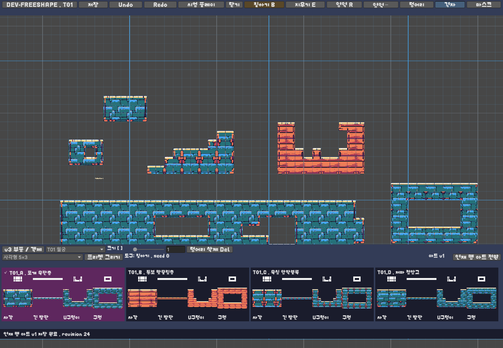
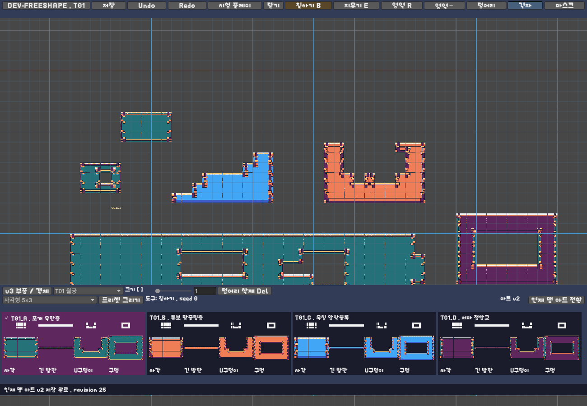
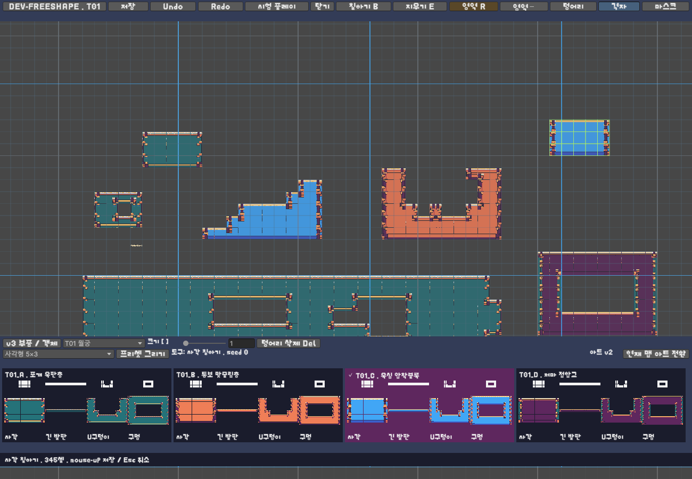
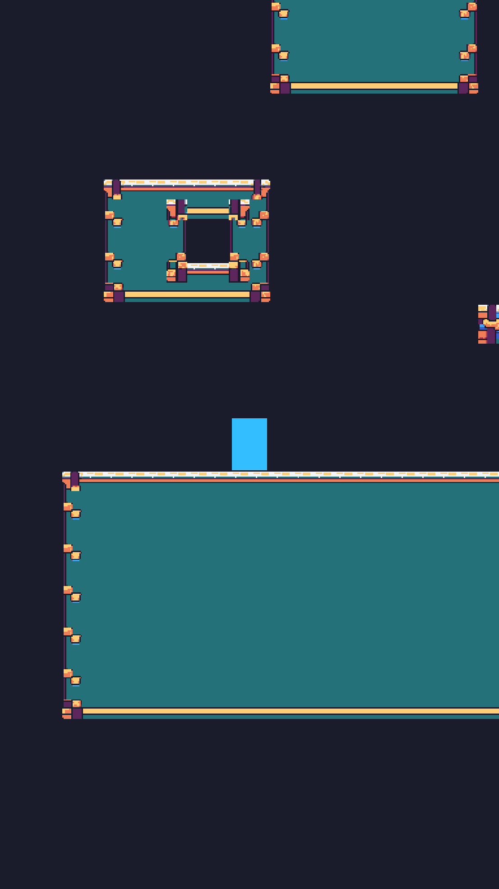

# ANIMOL clean_v2 아트 적용 결과

작업일: 2026-10-06. 기존 Scene View 자유형 맵 에디터에 별도 아트 버전 2를 연결했다. 기존 v1 아트나 사용자 맵을 자동 전환하지 않는다.

## 사용 방법

1. `ANIMOL > Terrain Free Shape > Initialize Clean Art V2`로 설치 자료를 검증·등록한다. 이번 작업에서 실제 실행했다.
2. 원하는 `StageMapDefinition`을 선택하고 `ANIMOL > Map Editor > Open Scene Editor V4`를 연다.
3. 자유형 패널의 **현재 맵 아트 전환 > v2 · clean_v2**를 명시적으로 선택한다. 현재 버전은 `아트 v1/v2`로 표시된다.
4. 기존 칠하기·지우기·사각 영역·프리셋·덩어리 이동·Undo/Redo·저장·시험 플레이를 사용한다. v1로 되돌리는 명시적 작업도 같은 메뉴에 있다.

아트 설치, 창 열기, 재컴파일만으로 맵 버전을 변경하지 않는다. Ready, 보상, 캠페인 스테이지 배정 승인과는 관계없는 작업이다.

## 입력 자료와 등록

세부 명세는 ZIP의 `Docs/ANIMOL_CLEAN_ART_V2_APPLY.txt`다. 기존 적용 보고서와 현재 클래스·메서드를 대조했다. `sprite_lookup.json`, `topology_catalog.json`, `style_catalog.json`, `terrain_composition.mjs`, 승인 원본 매핑, 픽셀 마감 기준 및 패키지 검수 기록을 읽었다.

제작 자료 전체: `Tools/ArtSources/ANIMOL_FreeShape_Sprites_clean_v2`. 승인 원본은 `SourceArt/Approved/T01.png`~`T05.png`이며 추가 디자인 생성·재채색·장식 삭제 없이 제공 PNG 바이트를 사용했다. `.gitattributes`는 manifest 대상 파일의 체크아웃 줄바꿈 변환을 막는다.

| 항목 | 결과 |
|---|---|
| manifest 검증 | 5,975개 파일의 크기·SHA256 일치 |
| manifest SHA256 | `f518a95a64590e69365de87fdad9f3b67525d1039b47c1f6f2189d325f482b73` |
| 계약 / schema / artVersion | `ANIMOL_FREE_SHAPE_BLOB47_V1` / 1 / 2 |
| 스타일 | 기존 `T01_A`~`T05_D` 20개 |
| v1 레지스트리 | `Assets/ANIMOL/Resources/ANIMOL_FreeShapeArt.asset` |
| v2 레지스트리 | `Assets/ANIMOL/Resources/ANIMOL_FreeShapeArtV2.asset` |
| v2 운영 에셋 | `Assets/ANIMOL/TerrainFreeShape/V2/Art/Atlases` 80 PNG + `Art/Motifs` 20 PNG |
| 셀 Sprite | 47마스크 × 4위상 × 20스타일 = 3,760개 subasset |
| 별도 셀 PNG / 원화 / 참고 패널 | Assets에 중복 임포트하지 않음 |
| 최초 등록 시간 | 224,217ms, 현재 Windows Unity Editor 측정 |

셀은 Multiple, 32×32px, PPU32, FullRect, 중앙 pivot이다. 문양은 128×128px, PPU32, bottom-left pivot이며 추가 점유 0이다. Point, 무압축, MipMap Off, sRGB, alphaIsTransparency Off를 적용했다. rect는 `atlasHeight-y-height`로 변환한다. 별도 색 양자화·블러·윤곽선 Shader를 추가하지 않았으며 `Sprites/Default`를 사용한다. Sprite 이름은 lookup의 셀 파일명과 명시적인 style/phase ID로 구성한다.

## 연결 및 트랜잭션

- `FreeShapeArtRegistry.Load(contract, version)`는 v1/v2를 정확히 선택한다. 알려지지 않은 계약·버전, 불완전한 마스크/스타일/셀/문양 레지스트리는 오류로 거절한다. v2 부재 시 v1로 대체하지 않는다.
- `StageMapDefinition.ReadTerrain` 및 후보 검증이 해당 아트 레지스트리의 완전성을 확인한다. 저장 정본은 기존 `StageMapDefinition.freeShapeTerrain`이다.
- `TerrainEditorAdapter.ChangeFreeShapeArtVersion`은 Read → 버전만 변경한 후보 → Validate → 기존 Commit을 사용한다. 같은 버전 재선택은 no-op이고 실제 전환은 revision을 한 번 증가시킨다.
- 기존 Bridge의 Undo group·변경 전 백업·저장·실패 롤백을 사용한다. 좌표·styleId·seed·baseCells·placements·객체는 보존한다. 아트 버전은 기존 content hash에 반영된다.
- Scene 썸네일·프리셋·배치 후보와 Runtime이 맵 버전으로 레지스트리를 선택한다. 렌더러는 버전 변경 시 모든 셀과 의존 문양을 갱신하여 Undo/Redo에서도 이전 아트가 남지 않도록 했다.
- 47마스크, 대각선 게이팅, 전역 좌표 4위상, FNV-1a 및 동일 스타일 6×6 지지 조건의 4×4 문양 규칙은 변경하지 않았다. 천장·측면을 회전 Sprite로 대체하지 않는다.
- 아트 Tilemap에는 Collider가 없다. 기존 operational Tilemap이 점유 셀 충돌을 소유하며 구멍/빈 셀을 추가 Collider로 막지 않는다.

## 이번 실행의 검사

원본 패키지 QA 기록은 제작 당시 기록이다. 아래의 새 결과와 과거 v1 PASS 숫자를 혼합하지 않는다.

| 검사 | 이번 결과 |
|---|---|
| Python 패키지/승인 원본/팔레트/알파/셀 PNG 대 atlas rect | PASS, 3,760셀 일치 |
| 패키지 Node topology 검사 | PASS, 7그룹, 256 raw, 65,536개 4×4 배치, 524,288 점유 맥락 |
| Unity Scene/Runtime PNG 비교 | PASS, 20스타일 × 16형태 × 2경로 = 640회 |
| 픽셀 비교 | 37,888,000픽셀, 보이는 RGB 차이 0 / 알파 차이 0 |
| 실제 고체/빈 셀 검사 | 위 320형태의 operational TilemapCollider2D.OverlapPoint 일치, 아트 Collider 0 |
| FreeShapeTerrainTests | v1 17/17, v2 17/17 PASS |
| TerrainEditorV4Tests / TerrainStructureIntegrationTests | 14/14, 13/13 PASS |
| CommercialPolishPolicyTests | 3/3 PASS |
| FreeShapePlayModeTests | v1 2/2, v2 2/2 PASS. 각각 20스타일 실제 플레이어 착지 및 일방통행 상승/하강 |

비교 경로는 실제 `TerrainEditorArt.BuildMap`과 `StageMapRuntimeLoader.Load`다. 같은 점유·seed=0으로 패키지 Samples와 카메라 RenderTexture를 비교했다. 대형 청크 fixture는 원점 (-17,-17), 34×6셀이며 음수 좌표와 청크 경계를 포함한다. 사각형, 구덩이, 내부 구멍, 천장/돌출부, 1셀 가로/세로, 계단, T자, 대각 접촉, 여러 덩어리 등 패키지 16형태 모두를 실행했다. 이 비교는 별도 격리된 Editor 테스트 장면에서 Runtime 로더까지 실행한 결과이며, PlayMode 검사는 별도로 기록한다.

첫 EditMode 실행은 검사 중 MCP 상태 조회가 타임아웃되면서 플러그인이 `NetworkStream disposed` 오류를 기록해 일부 테스트가 실패했다. 실패 기록을 보존했으며 관련 검사 재실행에서는 실행 도중 Unity 조회를 하지 않았다. 로그 무시나 assertion 완화로 통과시키지 않는다.

검증 산출물: [패키지](Validation/CleanArtV2/PackageVerification.json), [Node](Validation/CleanArtV2/TopologyValidation.json), [픽셀 비교](Validation/CleanArtV2/ArtParity.json), [EditMode 61개](Validation/CleanArtV2/EditMode.json), [연출 정책 3개](Validation/CleanArtV2/CommercialPolishPolicyTests.json), [PlayMode](Validation/CleanArtV2/PlayMode.json), [첫 실행 통신 실패](Validation/CleanArtV2/EditMode-first-transport-failure.json).

## 실제 시각 검수와 남은 표현

승인 원화 5장을 직접 열어 확인했다. 실제 Unity 렌더를 원본 크기로 배치한 [T01](Validation/CleanArtV2/Review/T01-native.png), [T02](Validation/CleanArtV2/Review/T02-native.png), [T03](Validation/CleanArtV2/Review/T03-native.png), [T04](Validation/CleanArtV2/Review/T04-native.png), [T05](Validation/CleanArtV2/Review/T05-native.png)에서 20스타일의 8형태를 확인했다. 주요 색 배합·걸쇠·측면·상하 마감과 빈 공간이 제공 PNG와 동일하게 나타난다.

`Review/<style>-zoom.png`는 최근접 4배/8배 이미지다. 직접 연 스타일은 T01_A/B, T02_B/D, T03_D, T04_A, T05_B/C/D다. 각 이미지에 PNG 좌상단 좌표, crop 범위와 배율이 표시된다. 모든 셀의 미관 검수나 사람의 최종 디자인 승인을 주장하지 않는다.

추가로 `Review/T01-motifs.png`~`T05-motifs.png` 다섯 장에서 20스타일의 16×16 지형을 원배율, 문양 경계를 최근접 4배로 확인했다. 문양의 앵커 셀 좌표와 PNG crop 좌표는 각 이미지에 기록했다. T01 문양 끝캡 등의 작은 명암 면도 패키지와 동일하며 임의로 지우지 않았다.

| 관찰 | 파일·좌표·확대 증거 | 처리 |
|---|---|---|
| T05_B 광맥이 64px 재료 반복에서 끊어져 보임 | `Renders/T05_B-maximum_rectangle_16x16-Scene.png`, PNG crop (64,256)-(128,320), [8배](Validation/CleanArtV2/Review/T05_B-zoom.png) | 패키지와 픽셀 일치. 제작 QA에도 명시된 반복 특성. 원화 대체/재생성 없이 보존 |
| T02_D 상단/내곽 레일의 검은 반복 디테일 | `Renders/T02_D-closed_hole-Scene.png`, (0,0)-(128,128), [4배](Validation/CleanArtV2/Review/T02_D-zoom.png) | 패키지와 동일. 검출 후보만으로 Doubles 오류라고 확정하거나 삭제하지 않음 |
| T03_D 접힘과 T05_D 쐐기의 작은 색면/끝점 | 해당 스타일 `maximum_rectangle_16x16`, (64,256)-(128,320), [T03_D](Validation/CleanArtV2/Review/T03_D-zoom.png), [T05_D](Validation/CleanArtV2/Review/T05_D-zoom.png) | 패키지 표현 보존. 모든 Jaggies/Doubles 제거 완료로 보고하지 않음 |

확대 검토에서 발견한 위 표현은 Unity rect/회전/필터 오차가 아니다. 이번 패치에서 원본 PNG 픽셀을 수정하지 않았다. 서로 다른 스타일/v3 사이의 전용 전환 아트는 패키지에 포함되지 않는다.

## 보존, 개발 맵 및 실제 화면

작업 시작 시 기록한 기존 14개 StageMapDefinition의 전체 Editor JSON·revision·hash가 최종 비교에서도 모두 같고 artVersion=1을 유지한다. v1 Sprite 3,780개 GlobalObjectId와 기존 Data/v1 아트 관련 파일 598개의 SHA256도 모두 동일하다. 기존 미커밋 변경은 이번 커밋에 포함하지 않았다. 증거: [Unity 보존](Validation/CleanArtV2/UnityPreservation.json), [파일 보존](Validation/CleanArtV2/FilePreservation.json).

별도 `Assets/ANIMOL/Data/Development/CleanArtV2`에 개발 맵 6개를 만들었다. `DEV-CLEAN-V2-T01`~`T05`는 각각 4스타일 × 16형태, 3,028셀이다. 저장된 5개 에셋을 실제 Runtime loader로 다시 읽어 각각 고체 3,028셀과 빈 셀 32,108개를 검사했고 아트 Collider는 0개였다. [개발 맵 결과](Validation/CleanArtV2/SavedDevelopmentValidation.json). 캠페인 배정이나 Ready 승인은 하지 않았다.

`DEV-CLEAN-V2-COPY`는 기존 `DEV-FREESHAPE`의 별도 복사본이다. 최초 명시적 전환 전후 직렬화 필드 차이는 `artVersion: 1 → 2`, `authoringRevision: 22 → 23`뿐이었다. 셀 330개·seed·styleId·기존 객체·스탬프·충돌 데이터는 그대로다. 전후 화면을 찍기 위한 v1/v2 왕복 후 revision은 25다. 복사본의 stableStageId도 원본과 같으므로 운영 스테이지로 배정하지 않는다. [전환 전체 JSON](Validation/CleanArtV2/DevelopmentCopyConversion.json).

실제 Scene View에 마우스/키보드 이벤트를 보내 사각 칠하기, 내부 구멍 지우기, 덩어리 이동·삭제, Ctrl+Z/Y를 검증했다. MouseUp 전에는 맵이 바뀌지 않았고 검증 편집은 전부 Undo했다. 창 닫기·저장 파일 재임포트·다시 열기 후 v2, 330셀, revision 25, 파일 바이트와 content hash가 같았다. [Scene 입력](Validation/CleanArtV2/SceneInput.json), [재열기](Validation/CleanArtV2/Reopen.json).

기존 **시험 플레이** 버튼을 실제 눌러 Local Play를 실행했다. 원본/런타임 content hash가 같고, 점유 330셀과 빈 셀 1,398개를 검사했다. DevPlayer의 실제 착지, 모든 아트의 v2 경로, 아트 Collider 0개를 확인했다. 종료 후 EditMode와 Bootstrap 씬으로 복귀했다. [Local Play](Validation/CleanArtV2/LocalPlay.json).

| 전환 전 Scene | 전환 후 Scene |
|---|---|
|  |  |

[Game View 전체 캡처](Validation/CleanArtV2/Runtime.png)에는 기존 Local Play가 카메라를 RenderTexture로 출력하는 구성 때문에 Unity의 `Display 1 No cameras rendering` 안내가 겹친다. 위 이미지는 그 카메라의 실제 RenderTexture를 읽은 결과다. 안내 오버레이는 이번 아트 패치에서 수정하지 않은 기존 미리보기 문제로 남긴다.

## 최종 실행 상태와 비용

- Unity 6000.3.8f1 컴파일 완료, Console의 `error CS` 항목 0개. 신규 builder의 구형 `TextureImporter.spritesheet` API에는 사용 중단 예정 경고가 있으나 현재 Unity에서 임포트·재등록·GUID 보존을 검증했다.
- 최종 EditMode **65/65**, PlayMode **4/4** PASS. EditMode 합계는 일반 61 + 연출 정책 3 + [PNG parity 1](Validation/CleanArtV2/ParityTest.json)이다.
- 실제 재등록 5,765ms, v2 Sprite 3,780개 참조가 모두 유지됐다. 해당 측정 시 Editor Profiler의 텍스처 메모리는 v1/v2 각각 100장, 34,168,320바이트(약 32.59MiB), 동시 합계 약 65.17MiB였다. Editor 측정이며 모바일 메모리 보장은 아니다. [재등록/메모리](Validation/CleanArtV2/Reinitialize.json).
- 일부 긴 CLI 검증은 5초 응답 제한을 넘었지만 Editor에서 계속 실행되어 완료 JSON을 남겼다. 완료 파일을 확인한 결과만 기록했다. Scene 이벤트 검증 초기에는 좌표 컨텍스트 및 GUILayout 경고가 있었으며 Repaint 후 실제 칠한 셀 기준으로 검증을 다시 실행했다. 최종 검증용 편집은 모두 복구했다.

## 변경 파일

`FreeShapeArtV2Builder.cs`, `FreeShapeArtRegistry.cs`, `FreeShapeTerrainRenderer.cs`, `AnimolFreeShape.cs`, `StageMapDefinition.TerrainStructures.cs`, `TerrainEditorAdapter.cs`, `TerrainEditorSceneEditor.FreeShape.cs`, 자유형 EditMode/PlayMode 테스트, 신규 픽셀 비교 테스트, 별도 v2 운영 에셋·레지스트리·meta, 제작 자료, 검증용 도구·개발 맵·보고서다. 기존 v1 builder와 v1 PNG/meta/레지스트리는 덮어쓰지 않는다.

정확한 경로 목록은 [ChangedFiles.txt](Validation/CleanArtV2/ChangedFiles.txt)에 기록했다. 검증 C# 파일은 연결된 Editor에서 `unity command eval_file --file <파일> --format json`으로 실행한다. `CheckPreservation.cs`는 작업 시작 시 Library에 기록한 기준 자료가 필요하다. 패키지 검증은 `python Tools/Validation/verify_clean_art_v2.py`, 검수 보드는 `python Tools/Validation/review_clean_art_v2.py`로 생성한다.

모바일 실기기 빌드/메모리/프레임 성능, 운영 배포, 모든 합법 인접의 사람 미관 검수는 미실행이다.
