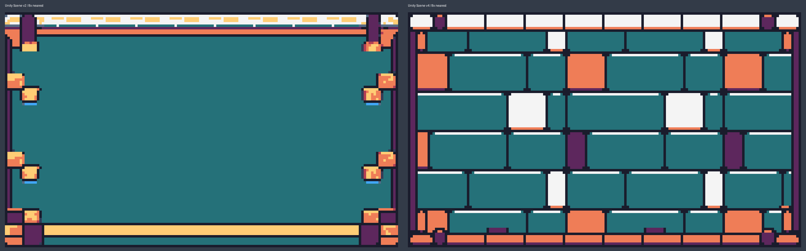
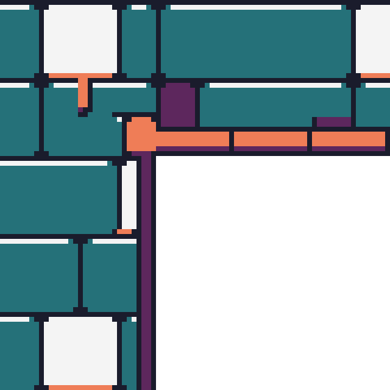
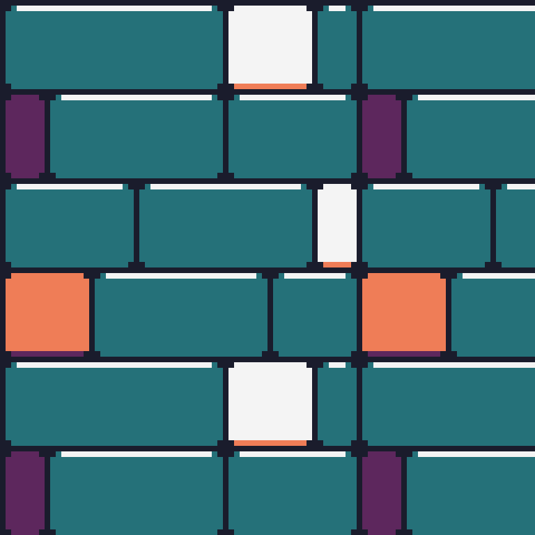

# ANIMOL joint_finish_v4 적용 결과

2026-10-06, Unity 6000.3.8f1. 기존 Scene View 자유형 편집기에 **별도 artVersion 4 레지스트리**를 연결했다. 현재 맵의 자유형 패널에서 **현재 맵 아트 전환 → v4 · joint_finish_v4**를 선택하면 기존 Read/Validate/Commit으로 해당 맵만 전환한다. 설치·창 열기·재초기화는 기존 맵을 전환하지 않는다.

## 패키지와 수정 범위

정상 ZIP 28,684,692 bytes를 `Tools/ArtSources/ANIMOL_FreeShape_Sprites_joint_finish_v4`에 보관했다. ZIP CRC와 manifest의 **6,012개 파일 크기·SHA256**을 확인했다. manifest 자체를 포함한 파일은 6,013개다. 이전 불완전 ZIP 진단은 `6109f9f`의 이력이며 이번 정상 패키지 적용 결과와 구분한다.

`ANIMOL_JOINT_FINISH_V4_APPLY.txt`, lookup/source rect/topology/style catalog, `terrain_composition.mjs`, `build_joint_native_sources_v4.mjs`, `joint_native_layout_v4.json`, v4 출력 검수 기록을 읽었다. 제공된 최종 PNG를 그대로 사용했고 이미지 생성·재채색·추가 필터·자동 윤곽을 적용하지 않았다.

v3 패키지 원본 manifest 5,988개를 다시 검증한 뒤 비교했다. v3 대비 운영 PNG 100개 중 **T01_A 아틀라스 4장만 변경**, 문양을 포함한 96개는 동일하다. 다른 19스타일의 전체 PNG 5,605개/2,717,143 bytes도 파일 목록·바이트가 동일하다. v2와도 다른 19스타일의 실제 Unity 렌더 304개가 동일하다.

[패키지 해시](Validation/JointFinishV4/PackageVerification.json), [변경 PNG 4장의 SHA256](Validation/JointFinishV4/OperationalPngComparison.json), [19스타일 실제 렌더 비교](Validation/JointFinishV4/V2V4RenderComparison.json).

커밋 직전 Git index의 패키지 6,013개 파일도 크기·SHA256을 다시 비교해 불일치 0이었다. 시작 시점에 이미 변경되어 있던 파일은 스테이징 목록에 0개다. [스테이징 검사](Validation/JointFinishV4/StagedPackageVerification.json). 직접 수정한 C#·보고서의 `git diff --cached --check`는 통과했다. 전체 검사에서 Unity 생성 meta의 빈 YAML 값 뒤 공백과 원본 패키지 CRLF/EOF 공백은 경고되며, GUID와 manifest 바이트 보존을 위해 그대로 유지했다.

## 등록 및 코드 연결

| 항목 | 실제 경로/동작 |
|---|---|
| 제작 자료 | `Tools/ArtSources/ANIMOL_FreeShape_Sprites_joint_finish_v4` |
| 운영 아트 | `Assets/ANIMOL/TerrainFreeShape/V4/Art/Atlases` 80장, `Art/Motifs` 20장 |
| 레지스트리 | `Assets/ANIMOL/Resources/ANIMOL_FreeShapeArtV4.asset` |
| Resources 키 | `ANIMOL_FreeShapeArtV4` |
| 설치 메뉴 | `ANIMOL/Terrain Free Shape/Initialize Joint Finish Art V4` |
| 등록 수 | 20스타일, 3,760개 셀 Sprite, 문양 20개, 독립 텍스처 100개 |
| 기존 맵 전환 | 현재 선택 맵만 명시적 전환; revision 1회 증가·hash 갱신 |

`FreeShapeArtV4Builder.cs`를 추가하고 기존 `FreeShapeArtV2Builder.cs`의 검증·임포트 코드를 매개변수로 재사용한다. `FreeShapeArtRegistry.cs`가 정확한 버전의 Resources 키를 선택한다. `AnimolFreeShape.cs`는 알려진 버전 1/2/3/4만 허용하고, 레지스트리 누락/버전 불일치/불완전 참조는 계속 거부한다. Scene 패널의 버전 메뉴를 확장했다. 기존 썸네일·배치 후보·렌더 캐시는 맵 버전의 레지스트리를 그대로 사용한다.

계약 `ANIMOL_FREE_SHAPE_BLOB47_V1`, schemaVersion 1, 32px/PPU32/논리 1×1, 47마스크·256 raw 상태·4위상·전역 좌표 seed·음수 청크 floor division을 유지한다. 아틀라스 Multiple/FullRect/중앙 pivot, 문양 bottom-left, Point/압축 None/MipMap Off/sRGB이다. rect의 y는 `atlasHeight-y-height`로 변환한다. 추가 양자화 셰이더는 없고 기존 `Sprites/Default`를 사용한다.

개별 셀 PNG·샘플·원화·참고 패널은 Assets에 중복 임포트하지 않았다. 다른 버전의 텍스처를 공유하지 않고 v4 전체를 별도 등록했다. 문양의 동일 스타일 4×4+주변 1셀 지원 규칙, 추가 점유/Collider 0, 기존 고체 충돌 소유자와 one-way 경로를 유지했다.

실제 임포트는 **397.706초**, 동일 패키지 재초기화는 **6.306초**였다. 재초기화 전후 v4 Sprite GlobalObjectId **3,780개 모두 동일**하다. v1/v2/v4는 각각 독립된 100개 텍스처를 참조하며 Editor 측정 메모리는 버전당 **34,168,320 bytes (32.59 MiB)**, 합계 102,504,960 bytes다. [등록 검사](Validation/JointFinishV4/Registration.json), [재초기화/메모리 검사](Validation/JointFinishV4/Reinitialize.json).

## 버전 및 기존 데이터 보존

사용자의 앞선 지시에 따라 v3 미커밋 설치를 폐기한 상태에서 시작했다. **실제 설치 버전은 v1/v2/v4**다. v3 레지스트리/PNG를 재설치하지 않았다. v3 전환 메뉴는 미설치로 비활성화되며, v3 요청을 v1/v2/v4로 대체하지 않는다. v3 원본 ZIP 및 기존 제작 자료는 보존했다.

**보존 검사 예외가 1건 남아 있다.** 시작 시점의 830개 기존 파일 중 829개는 SHA256이 동일하다. v1/v2 레지스트리·PNG·meta와 Sprite GlobalObjectId 7,560개도 동일하다. 기존 맵 22개 중 21개는 전체 직렬화·hash·revision이 동일하다.

`Assets/ANIMOL/Data/Campaign/Maps/T01-S01.asset`은 작업 도중 16:56~16:57에 revision 205→210, artVersion 2→4 및 T01_B 셀 편집이 발생했다. 검증 스크립트의 명시적 작업 대상은 별도 개발 복사본이다. 이 변경의 주체는 확정하지 못했으며 사용자에게 직접 편집 여부를 문의했다. 출처가 확정되지 않은 변경을 덮어쓰지 않기 위해 해당 파일과 자동 백업은 그대로 보존하고 이번 커밋에서 제외한다. 따라서 **모든 기존 맵이 무변경이라는 판정은 내리지 않는다**. [Unity 보존 비교](Validation/JointFinishV4/UnityPreservation.json), [파일 보존 비교](Validation/JointFinishV4/FilePreservation.json).

별도 `Assets/ANIMOL/Data/Development/JointFinishV4`에 개발 맵 6개를 생성했다. `DEV-JOINT-V4-COPY`는 기존 개발 맵의 복사본이며, 원본 맵을 수정하지 않고 복사본에서 버전을 전환했다. `DEV-JOINT-V4-T01`~`T05`는 각 4스타일×16형태, 3,028셀이다. 캠페인 배정/Ready 승인/보상/서버는 변경하지 않았다. 최종 보존 비교에서 COPY에도 검증 완료 후 추가 이동이 발견돼 COPY와 meta는 작업 폴더에 보존하되 커밋에서 제외했다. 커밋에는 5개 테마 검증 맵만 포함한다.

## 실제 실행한 검사

패키지 사본에서 Node 24.19.0과 sharp 0.35.4로 원본 검사 스크립트를 실행했다. 보고서 출력은 원본 패키지를 변경하지 않도록 사본에 남겼다. 실행 명령은 `validate_joint_finish_v4.mjs --baseline-v3 <검증된 v3 소스>`, `validate_topology.mjs`, `validate_sprite_files.mjs`, `validate_gallery.mjs`다.

| v4 패키지 검사 | 결과 |
|---|---|
| 접합 전용 검사 | PASS, failureCount 0 |
| 몸체 하이라이트/그림자 | 168px/31px, 불일치 0 |
| 등록된 둥근 모서리 2×2 ink | 48개, 미등록 0 |
| 80분면·188셀의 장식 외 몸체 | 137,220px, 불일치 0 |
| 다른 19스타일 | 5,605 PNG 전체 동일 |
| 연결 검사 | 65,536개 4×4 점유, raw 256, 셀 맥락 524,288, 공유 경계 393,216; PASS |
| Sprite/atlas/sample 검사 | 28,446,720px; PASS |
| 갤러리 논리 검사 | 셀 15,140·문양 60·위상 216; PASS |

[접합 검사 원본 결과](Validation/JointFinishV4/Node-joint_finish_validation.json).

Unity 컴파일 완료 후 실제 연결된 Editor에서 **EditMode 89개 + PlayMode 6개 = 95개 PASS**, 실패·건너뜀 0으로 완료했다.

| 검사 | 결과 | 시간 |
|---|---|---|
| FreeShapeArtV2ParityTests | 2 PASS | 79.10초 |
| FreeShapeTerrainTests | 57 PASS | 576.93초 |
| TerrainEditorV4Tests | 14 PASS | 123.60초 |
| TerrainStructureIntegrationTests | 13 PASS | 12.24초 |
| CommercialPolishPolicyTests | 3 PASS | 0.30초 |
| FreeShapePlayModeTests | 6 PASS | 70.47초 |

검사는 v1/v2/v4의 버전 전환 조합·동일 버전 no-op·Undo/Redo·저장/재열기·파생 캐시 복원, 검증/쓰기/프리뷰 실패 롤백, 문양 지지 제거/복원, 음수 좌표·청크 경계·객체 충돌·빈 셀 및 one-way를 포함한다. PlayMode는 각 버전의 20스타일 실제 DevPlayer 착지와 one-way를 실행했다. 기존 Scene 편집기가 전역 편집 브리지를 소유하지 않도록 닫고 legacy 통합 테스트를 실행했다. 테스트 중 MCP 연결의 무관한 timeout 로그 유입을 막기 위해 해당 연결을 일시 중지했고 종료 시 연결이 복구된 상태를 확인했다.

같은 좌표·점유·seed=0으로 실제 `TerrainEditorArt.BuildMap` 및 `StageMapRuntimeLoader.Load`를 호출하고 Camera RenderTexture를 패키지 Samples와 비교했다. **20스타일×16형태×Scene/Runtime=640회, 37,888,000픽셀의 RGB/alpha 차이 0**이다. v2도 별도로 640회를 실행했다. 모든 v4 Scene/Runtime 원배율 출력 640장을 `Validation/JointFinishV4/Renders`에 저장했다. 이 검사는 Editor의 격리된 장면에서 실행한 Runtime loader 비교이며, PlayMode 검사는 별도다.

T01_A **47마스크×4위상=188셀**은 실제 SpriteRenderer로 추가 렌더해 제공 아틀라스와 비교했다. 196,608픽셀 차이 0이다. [검사 수치](Validation/JointFinishV4/AllT01AMasks.json), [위상 0 원배율](Validation/JointFinishV4/T01_A-AllMasks-v0-Unity.png), [8배 확대](Validation/JointFinishV4/Review/T01_A-AllMasks-v0-Unity-8x.png).

Scene View 실제 마우스 이벤트로 12셀 칠하기·내부 구멍 지우기·덩어리 이동·삭제를 수행하고 키보드 Undo/Redo로 원래 330셀·hash·revision을 복원했다. [실제 입력 검사](Validation/JointFinishV4/SceneInput.json). v1/v2/v4 각각 명시적 전환→Undo/Redo→저장→강제 재임포트/재열기를 확인했다. 전환은 artVersion과 revision/hash만 바꾸며 좌표·styleId·seed·객체·스탬프는 동일했다. 결과는 `SelectSaveReopen-v1/v2/v4.json`에 기록했다.

각 버전에서 실제 Scene의 시험 플레이 버튼을 눌러 Local Play를 실행했다. 330개 고체 셀·670개 빈 셀의 충돌 판정, 실제 DevPlayer 착지, 올바른 버전의 아트 참조, Scene/Runtime map hash 일치 및 art Collider 0을 확인했다. [v1](Validation/JointFinishV4/LocalPlay-v1.json), [v2](Validation/JointFinishV4/LocalPlay-v2.json), [v4](Validation/JointFinishV4/LocalPlay-v4.json). 별도 5개 테마 개발 맵에서도 각 3,028개 고체 셀·32,108개 빈 셀을 검사했다.

긴 Unity eval은 CLI의 5초 응답 제한을 넘겼다. 성공 응답으로 오인하지 않고 Unity가 기록한 완료 파일과 후속 상태로 확인했다. 수동 검증 도중 선택 버전이 달라진 사례는 순차적으로 다시 실행해 실제 v1/v2/v4 Local Play 결과를 각각 남겼다. 마지막 v4 전환 기록은 2→4, revision 30이며 이후 개발 복사본에 revision 33이 관측됐다. 최종 비교에서는 330셀 수는 같지만 위치 86개가 이동되어 있었다. 이 추가 편집의 주체도 확정되지 않았으므로 임의 복구하거나 패치에 섞지 않았다. [최종 상태](Validation/JointFinishV4/FinalDevelopmentState.json)의 `onlyVersionAndRevisionChanged=false`는 이 후속 비교 실패를 그대로 기록한 것이다. 앞선 전환/Undo/저장/Local Play 검사 시점의 PASS와 구분한다.

## 시각 검수와 캡처

[Scene v1](Validation/JointFinishV4/Scene-v1.png) · [Scene v2](Validation/JointFinishV4/Scene-v2.png) · [Scene v4와 실제 스타일 썸네일](Validation/JointFinishV4/Scene-v4.png) · [배치 후보](Validation/JointFinishV4/Scene-ghost.png) · [Local Play 실제 카메라](Validation/JointFinishV4/RuntimeRender-v4.png) · [Game View 전체](Validation/JointFinishV4/Runtime.png).

T01_A의 제공 native 소재/외곽/내곽 패널, 실제 Unity Scene/Runtime 원배율 및 최근접 8배 출력을 검토했다. 단일 셀, 얇은 가로/세로, 양방향·비대칭 계단, U자 구덩이, 내부 구멍, 천장/돌출부, T분기, 음수 청크 경계를 확인했다. 청록 윗면의 inset 하이라이트, 흰/산호 면 아래 그림자, radius1 모서리와 끝캡이 유지된다.

구멍 확대는 원본 PNG x=32..111/y=32..111, 청크 확대는 x=480..575/y=32..127 영역이다. 후자는 fixture 원점 x=-17 기준 전역 x=0 청크 경계를 포함한다. 검토 범위에서 새 임포트 이음·색 번짐·빈 공간을 가리는 연결은 발견하지 못했다. 자동 고립 픽셀이나 2×2 ink 후보를 전부 오류로 판단하지 않았다. 결과는 **등록되지 않은 접합 오류 0**이며 모든 jaggies/doubles나 모든 장식 곡선의 완전성을 승인하는 뜻이 아니다.

## 미실행 및 제한

- v3 선택/저장/재열기/Play는 미설치 상태이므로 미실행이다. 대신 미설치 v3의 선택/Commit/Runtime 거부와 원본 무변경을 실제 검사했다.
- Android/iOS 실기기·모바일 빌드는 미실행이다. 메모리는 연결된 데스크톱 Editor 기준이다.
- 모든 가능한 맵 조합의 미관을 수작업으로 전수 검수하지 않았다. 20스타일 전체를 수정한 결과가 아니다.
- 전체 기존 맵 무변경 검사는 위 캠페인 맵 1건 때문에 PASS로 처리하지 않았다. 변경 출처 확인이 남아 있으며 임의 복구하지 않았다.
- 실제 Game View 캡처에는 기존 RenderTexture 기반 시험 플레이의 `No cameras rendering` Editor 오버레이가 보인다. 아트 렌더와 물리는 정상이며 직접 Camera 출력도 별도 저장했다. 이 기존 Editor 표시 문제는 이번 아트 패치에서 수정하지 않았다.

변경 파일 전체 목록은 [ChangedFiles.txt](Validation/JointFinishV4/ChangedFiles.txt)에 기록한다. 기존 사용자 변경은 커밋에 포함하지 않는다.
