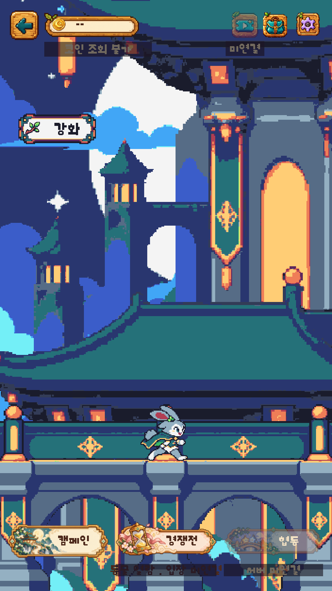
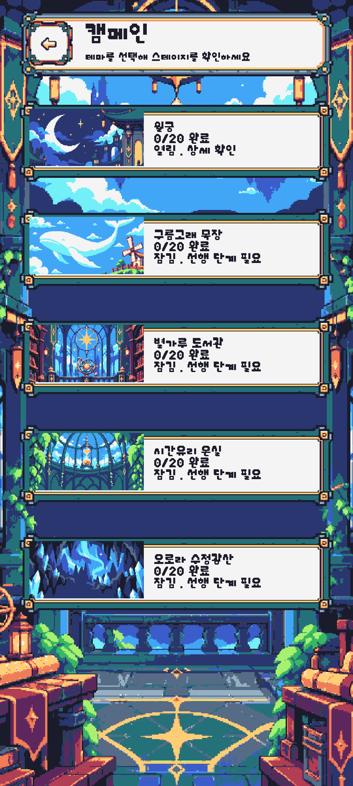

# ANIMOL Original Design Correction v2 적용 결과

작업일: 2026-10-06. 패키지 README_KO.md, manifest.json, Unity 적용 명령, UI 보정 JSON과 original-v7-contract.json을 읽고 **배경 연결 → SC02 표시 설정 연결** 순서로 적용했다. 새 디자인을 만들거나 제공 PNG를 다시 칠하지 않았다.

## 실제 연결과 변경 범위

- 운영 Bootstrap/Lobby의 `UI_CommonRoot → MainUiV7Cycle(MenuThemeCycle)`은 기존 `Resources/ANIMOLMainUiV7` 카탈로그를 사용한다. 카탈로그 GUID·Resources 키·compositor·씬 연결은 유지하고 T01~T05의 far/mid/platform/near 참조 20개만 교체했다.
- 새 운영 PNG는 `Assets/ANIMOL/UI/OriginalDesignCorrectionV2/runtime/main-background/`에 있다. 각 352×704, Point, Uncompressed, mipmap off, Clamp, NPOT None, PPU32, FullRect 설정이며 플랫폼 압축 override를 제거했다. 기존 Texture2D 합성 경로를 유지하므로 Sprite slicing/trim은 없다.
- `OriginalDesignCorrectionBuilder.ApplyBackground`는 manifest의 20개 ID·크기 선언·SHA256을 검사한 후 임포트하고 카탈로그를 저장한다. `MainUiV7Builder.Build`도 이 경로를 호출한다. 원래 22장 묶음을 덮어쓰는 동작은 제거했다. 이미 변경되어 있던 현재 토끼 두 시트를 과거 ZIP 원본으로 되돌리지 않는다.
- 제작·비교 자료 89개는 `Tools/ArtSources/ANIMOL_Original_Design_Correction_v2`에 보관했다. source/previews를 Assets에 수입하지 않았다.
- SC02는 기존 prefab 자식 대신 씬에 직렬화된 `SafeArea/ScreenHost/SC02_ThemeSelect/ProductionV1`을 `ProductionController`가 표시한다. 전체 UI 생성기나 prefab을 재생성하지 않았다.
- `CampaignStyleCorrection`은 `Resources/ANIMOLProductionV1/campaign-style-corrections.json`을 읽어 SC02 진입과 생성기의 `RefreshThemes`에서 기존 ThemePaper에 #f4f4f4, 실제 TMP 제목·진행도·상태에 #1a1c2c를 적용한다. 헤더/뒤로 PNG는 이미 밝은 면을 포함하므로 흰색 modulation을 유지한다. 배경 Image를 추가하지 않는다.
- 현장 카드 배경과 글자는 이미 목표색이었다. 이번 변경은 그 색을 패키지 JSON과 명시적으로 연결하고 재진입/재생성에도 유지하는 것이다. 참고 시안의 숫자를 데이터로 옮기거나 글자 이미지를 사용하지 않았다.

## 유지된 계약

배경 shader/운동 정책은 변경하지 않았다. platform은 (0,0) 고정, floorY=526, rabbit topY=436이다. T04의 제작 시 -1 이동을 런타임에 다시 적용하지 않았다. 5초 슬롯·0.36초 전환·14fps·88×72 이동·기존 독립 방향 seed·far/mid/near 크기와 시차를 유지했다.

현재 좌우 토끼 시트는 각각 512×96, 64×96의 8프레임이다. 실제 알파 발선은 `[90,90,90,86,90,90,90,86]`으로 확인했다. 핀·디자인·PNG·meta를 수정하지 않았다. [발선 검사](Validation/OriginalCorrectionV2/RabbitFeet.json).

SC02 PNG 교체는 **0개**다. 패키지 retainedArt에 적힌 배경·프레임·5썸네일의 SHA256은 현장 파일 7개와 모두 달랐다. 패키지 지침에 따라 현장 파일을 보존했다. [예상/실제 해시](Validation/OriginalCorrectionV2/PackageVerification.json). 프레임 중앙은 실제 투명하고 border L/B/R/T는 24/24/24/24다. 현장 ProductionV1 Sprite PPU는 100으로, 패키지 문서의 확인값 32와 다르다. 공유 아트의 Sliced 코너 크기와 기존 레이아웃을 보존하기 위해 이번 색 보정에서는 기존 importer를 변경하지 않았다. 새 메인 배경 20장은 요청대로 PPU32다.

버튼 콜백·Resources/Addressables 공개 키·서버 바인딩·CampaignCatalog·진행도 서비스·폰트·RectTransform·스크롤·터치 영역·CanvasScaler·SafeAreaLayout은 변경하지 않았다. 선택/잠금/완료 텍스트는 기존 progression과 실제 ThemeDefinition/StageDefinition에서 나온다.

## 실제 검증

Unity 6000.3.8f1에서 실제 실행했다. 최종 컴파일 실패 flag=false, compiling=false이고 Console error 0개다. [컴파일 상태](Validation/OriginalCorrectionV2/FinalCompile.json).

| 검사 | 결과 |
|---|---|
| 패키지와 설치 PNG 크기·SHA256·Sweetie16·이진 알파 | 20/20 PASS |
| 중앙 보행면 x70..282, PNG y526 | 5/5 PASS |
| 실제 importer 및 운영 카탈로그 | 20개 새 경로 연결, Point/무압축/no mip/FullRect/PPU32, 플랫폼 override 없음 |
| EditMode | MenuThemePolicy 3 + MenuHierarchy 3 + ProductionAsset 4 + CommercialPolishPolicy 3 = **13/13 PASS** |
| PlayMode | 기존 MenuThemeFlow 3 + ProductionFlow 7 + 신규 해상도/SC02 검사 2 = **12/12 PASS** |
| 1080×1920, 1080×2400 실제 순환 | 각각 실제 25.2초 이상, 5테마·양쪽 달리기·8프레임 확인 |
| full viewport 및 모의 Safe Area | 각 해상도에서 5카드 스크롤·실제 ThemeId 썸네일/이름/진행도·raycast 클릭·SC03 왕복·로비 복귀 PASS. 아래 장식 잘림 제한 별도 |
| 토끼 가림/화면 잘림 | 각 해상도 5테마 × 3시점(p=.2/.5/.8) × 카메라 2방향 × 토끼 2방향 × 8프레임 = 480조합, 각각 손실/잘림 0 |
| 제공 PNG CPU 합성과 실제 Unity native 출력 | 위 방향/시점 중 프레임0의 60건, 14,868,480픽셀, RGBA 차이 **0** |

검사 증거: [등록/GUID](Validation/OriginalCorrectionV2/Registration.json), [변경 전 참조](Validation/OriginalCorrectionV2/BeforeReferences.json), [1920 동선](Validation/OriginalCorrectionV2/1920-checks.txt), [2400 동선](Validation/OriginalCorrectionV2/2400-checks.txt), [960조합 중 1920](Validation/OriginalCorrectionV2/MotionAudit-1920.json), [2400](Validation/OriginalCorrectionV2/MotionAudit-2400.json), [렌더 비교](Validation/OriginalCorrectionV2/RenderParity.json).

테스트 결과 원문: [MenuThemePolicy](Validation/OriginalCorrectionV2/MenuThemePolicyTests.json), [MenuHierarchy](Validation/OriginalCorrectionV2/MenuHierarchyTests.json), [ProductionAsset](Validation/OriginalCorrectionV2/ProductionAssetTests.json), [CommercialPolishPolicy](Validation/OriginalCorrectionV2/CommercialPolishPolicyTests.json), [MenuThemeFlow](Validation/OriginalCorrectionV2/MenuThemeFlowTests.json), [ProductionFlow](Validation/OriginalCorrectionV2/ProductionFlowTests.json), [신규 PlayMode](Validation/OriginalCorrectionV2/PlayMode-correction.json).

첫 1920 자동 검사에서는 Editor 포커스가 빠져 기존 배경 시계가 멈췄다. [첫 실패](Validation/OriginalCorrectionV2/PlayMode-first-focus-failure.json)를 보존했고, 검증 코드에서만 포커스 상태를 foreground로 유지한 뒤 두 검사를 재실행했다. 게임의 실제 포커스 상실/복귀 로직은 바꾸지 않았으며 기존 MenuThemeFlow 검사도 통과했다. Inspector 시간 점프로 25초 순환을 대신하지 않았다.

기존 `V7ImportsPreserveAllTwentyTwoOriginalPNGs` 검사는 현재 승인된 토끼가 과거 Inbox 토끼와 같아야 한다는 오래된 전제를 가졌다. 새 20장과 실제 카탈로그의 일치, 현재 토끼의 프레임/발선 계약을 검사하도록 갱신했다. 현재 토끼 PNG/meta의 바이트 보존은 작업 전 SHA256과 별도로 확인했다.

### 실제 Game View 화면

| 화면 | 1080×1920 | 1080×2400 |
|---|---|---|
| 로비 T03 | [화면](Validation/OriginalCorrectionV2/1920_Lobby_T03.png) | [화면](Validation/OriginalCorrectionV2/2400_Lobby_T03.png) |
| SC02 상단 | [화면](Validation/OriginalCorrectionV2/1920_SC02_full_0.png) | [화면](Validation/OriginalCorrectionV2/2400_SC02_full_0.png) |
| SC02 하단 | [화면](Validation/OriginalCorrectionV2/1920_SC02_full_4.png) | [화면](Validation/OriginalCorrectionV2/2400_SC02_full_4.png) |
| 모의 Safe Area | [화면](Validation/OriginalCorrectionV2/1920_SC02_safe_0.png) | [화면](Validation/OriginalCorrectionV2/2400_SC02_safe_0.png) |

나머지 T01~T05, 60개 방향/시점 native 출력, 원본/Point 4배 검수 이미지는 같은 증거 폴더에 보관했다. 검증 후 Inspector 강제 시간/방향/프레임을 해제하고 시작 당시 1080×2160 Game View와 실제 로비 Play 상태로 돌아왔다.

## 시각 검토

패키지 5개 합성본을 352×704 원본 크기로 직접 열었다. 5개 다리의 원본/보정본 비교를 Point 4배로 직접 확인했다. 넓게 이어지는 기둥·상판·아치의 기본 면과 그림자가 유지되며 기존 산발적 점 명암이 줄었다. T01의 문양, T02 줄난간, T03 9개 창, T04 녹색 면과 파랑/금색 구조, T05 6개 창과 어두운 보강대가 남아 있다. 프레임 코너와 기존 썸네일도 4배로 확인했다.

비교 crop은 PNG 좌상단 `(0,470)-(352,640)`, 정수 4배다: [T01](Validation/OriginalCorrectionV2/Review/T01-bridge-4x.png), [T02](Validation/OriginalCorrectionV2/Review/T02-bridge-4x.png), [T03](Validation/OriginalCorrectionV2/Review/T03-bridge-4x.png), [T04](Validation/OriginalCorrectionV2/Review/T04-bridge-4x.png), [T05](Validation/OriginalCorrectionV2/Review/T05-bridge-4x.png). 전체 1408×2816 확대도 Review 폴더에 있다.

T01 아치 정상의 짧은 어두운 계단/선, T05 보강 아치의 두꺼운 구조선과 랜턴 사슬 점은 제공 PNG에 있는 표현이다. 모든 Jaggies/Doubles 후보를 결함으로 확정하거나 자동 삭제하지 않았다. 원화의 모든 윤곽이 일정한 1px이라고 주장하지 않는다. 밝은/기본/어두운 면의 경계와 구조 보강선은 의도된 두께를 유지했다.

## 미실행 및 남은 사항

- Android/iOS 실기기 빌드, 실물 노치/터치, GPU 성능과 메모리 검사는 미실행이다. Game View와 모의 Safe Area 검사를 기기 검증으로 대신 보고하지 않는다.
- SC02의 현장 아트 해시 7개와 Sprite PPU100은 패키지 문서와 다르며 현장 버전을 보존했다.
- 최종 Console에는 기존 MissingUtilityEntry가 생성하는 `MissingGoogleUnavailable`, `MissingCloudSaveUnavailable`, `MissingLocalSaveUnavailable` 등의 Missing Script 경고 60개가 있다. 해당 설정/계정 화면 prefab과 서버 파일은 이번 패치 범위에서 재생성하지 않았다. 컴파일 오류와 테스트 실패는 아니다. [경고 표본](Validation/OriginalCorrectionV2/FinalWarnings.json).
- 1080×1920에서 좌우 48px 모의 Safe Area를 적용하면 고정 1080폭의 기존 카드/헤더 오른쪽 장식 일부가 Safe Area 경계에서 잘린다. 클릭 중심과 스크롤 동선은 별도로 검사했다. 이번 요청의 기존 레이아웃 보존 조건에 따라 전체 UI 배치를 바꾸지 않았다.
- 작업 전 SC02 캡처 `SC02-before.png`는 화면 전환 중 프레임이므로, 보정 전후 색 대비를 입증하는 자료로 사용하지 않는다.

## 변경 파일 및 Git

기존 미커밋 파일 7,476개의 작업 전 SHA256을 기록했다. 7,473개는 최종 비교에서도 같고, Editor 실행 중 두 TMP fallback 에셋(`Pixelroborobo_Fallback.asset`, `Symbols_Fallback.asset`)과 `ANIMOLNamedArtReferences.json`이 자동 갱신됐다. 이 세 파일의 기존 변경을 되돌리거나 이번 커밋에 섞지 않았다. 원래 아트 관련 168개 파일 중 이번 참조 변경 대상 카탈로그 1개를 제외한 167개는 모두 바이트가 같다. ProductionV1 Sprite 60개와 토끼 2개의 GlobalObjectId도 동일하다. [보존 결과](Validation/OriginalCorrectionV2/Preservation.json).

변경 파일은 배경 builder/기존 builder 연결, 카탈로그 참조, 새 20 PNG/meta, SC02 색 설정 helper/JSON과 `RefreshThemes` 한 줄, 관련 검사, 제작 자료와 검증 도구·보고서다. 정확한 목록은 [ChangedFiles.txt](Validation/OriginalCorrectionV2/ChangedFiles.txt)에 기록했다.

재검증: Python 도구는 Pillow가 필요하며 CPU 렌더 비교는 NumPy도 필요하다. `verify_original_design_correction_v2.py`는 패키지/설치 PNG 검증과 검수 이미지 생성, `compare_original_correction_render.py`는 보관된 Unity native 이미지와 독립 CPU 합성을 비교한다. C# 검증 파일은 연결된 Editor에서 `unity command eval_file --file <파일>`로 실행한다. `InspectRegistration.cs`의 작업 전 참조 비교에는 Library에 기록한 baseline JSON이 필요하다.
